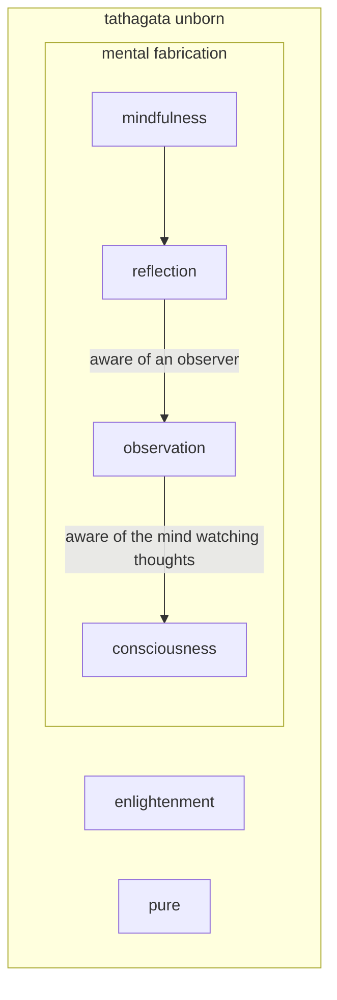

---
tags:
  - daily 
  - awareness
---
# awareness

!!! note "Pure and intrinsic awareness (jue-xing)"

      - That which knows and perceives, also known as the buddha nature inherent in all sentient beings.

!!! note "Awareness of observation (jue-cha)"

    - The mind attentively observes itself and notices the thoughts and afflictions that arise within.

!!! note "Awareness of reflection (jue-zhao)"

    - The mind clearly observes its own thoughts and counteracts the unwholesome ones by turning them into wholesome ones.

!!! note "Right mindfulness (zheng-nian)"

    - The state in which the mind is attending only to wholesome thoughts without attachments, a mind free of distraction and delusion, and ultimately free of thought, also known as no-thought.

!!! note "Consciousness (vi-sh)"

    - The thinking mind that gives rise to conceptualization, deluded thoughts, and dream states.

!!! note "Enlightenment or awakening (jue-wu)"

    - It is the mind that is awakened to its true nature. Freed of greed, anger, and ignorance, it attains a perfect understanding of reality. There are different levels of enlightenment, the highest being buddhahood.

-8<- "snippets/meditative.md"

## untrained mind

| Meditative                                                                                                   | Untrained                                                                                                                        |
|--------------------------------------------------------------------------------------------------------------|----------------------------------------------------------------------------------------------------------------------------------|
| Unity                                                                                                        | Duality – self separated from objects                                                                                            |
| Intentional                                                                                                  | Habitual                                                                                                                         |
| prone to generosity, love, wisdom                                                                            | prone to greed, hate, delusion                                                                                                   |
| Karma – aware of condition & causes and effects                                                              | unaware of Karma and conditioning                                                                                                |
| Open awareness or inter-being meaning knowing the observer and experience are interconnected and inseparable | Habitually conditioned to observing as a fixed sensation based center that is separated from the experience that is disconnected |
| Cessation of identification with impermanent things including consciousness and mental objects               | Habitually identified with fleeting thoughts often tied to fears of past and future and fleeting circumstances                   |
| Intentionally cultivating wisdom, awareness and compassion                                                   | Attaching and rejecting - Observation obscured by notions                                                                        |

<iframe width="700" height="394" src="https://www.youtube.com/embed/nNcFquUuKww" title="Give Up Your Conclusions | Sadhguru" frameborder="0" allow="accelerometer; autoplay; clipboard-write; encrypted-media; gyroscope; picture-in-picture; web-share" allowfullscreen></iframe>
