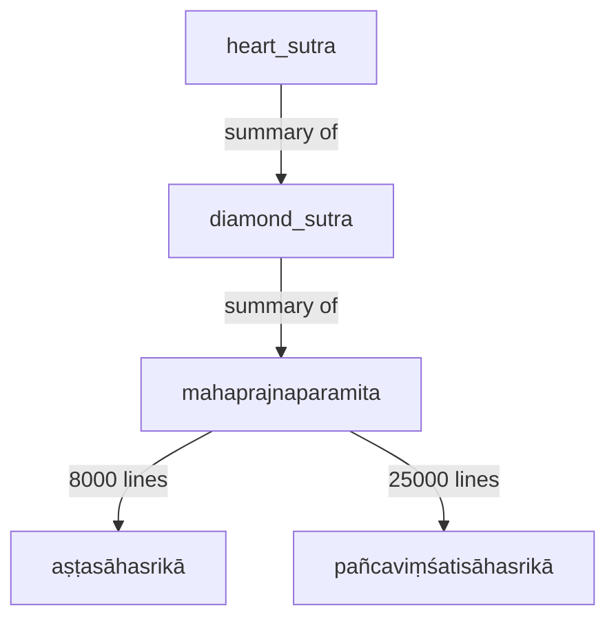
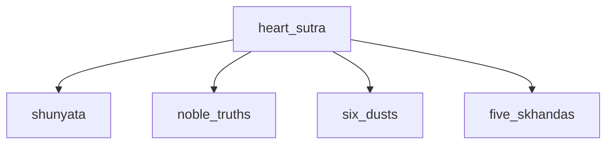
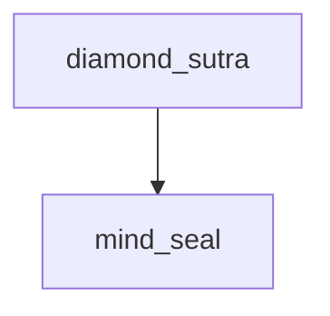
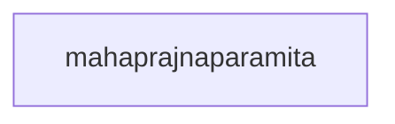

---
tags:
  - books 
  - meditation 
  - mind ground 
  - noble truths
  - samudaya 
  - heart sutra 
  - cormac mccarthy 
  - BTTS 
  - BDK 
  - dhammatalks
  - diamond sutra 
  - mahaprajnaparamita
---
# books

[heart sutra audio](){ .md-button } [diamond sutra audio](https://drive.google.com/file/d/1k8XpOOQtVXUy8AQWPMr-YlMuKCD_hBA7/view){ .md-button } [mahaprajnaparamita audio](https://youtube.com/playlist?list=PLJ1M78dFVbTyThaNlY0TFFAwB7cIMbccv&si=BWFGAptlHqg5l-ZS){ .md-button }

## heart sutra can be memorized

- I try to recite this from memory hourly

## diamond sutra

- 32 chapters takes 40 minutes for me typically once a day
- [mind ground meditation](mind_ground.md){ .md-button }
- [audio reading](https://drive.google.com/file/d/1k8XpOOQtVXUy8AQWPMr-YlMuKCD_hBA7/view)
- [diamond sutra sutra study book](https://www.ctworld.org.tw/Buddhist%20e-Books/Books06/index.html)
- [diamond sutra](https://www.ctworld.org.tw/Buddhist%20e-Books/Books01/index.html)
- [mind seal of prajna wisdom audiobook](https://www.ctworld.org.tw/Buddhist%20e-Books/Audio/Book007/index.html){ .md-button }

## mahaprajnaparamita

- mahaprajnaparamita takes weeks
- [mind ground meditation](mind_ground.md){ .md-button }

## free buddhist books

<iframe width="1109" height="672" src="https://www.youtube.com/embed/8jQMNOJcxCw" title="my favorite chan resources" frameborder="0" allow="accelerometer; autoplay; clipboard-write; encrypted-media; gyroscope; picture-in-picture; web-share" referrerpolicy="strict-origin-when-cross-origin" allowfullscreen></iframe>

- these my favorite sources for books that free and online
- some also have audio or video
- there is one I cannot find for free that can be found used for $30
- <https://www.ctworld.org.tw/Buddhist%20e-Books/>

### BDK

- BDK stands for Bukkyo Dendo Kyokai, which translates to the Society for the Promotion of Buddhism
- <https://www.bdkamerica.org/>

### dhammatalks

- <https://www.dhammatalks.org/books/>

### BTTS

- Buddhist Text Translation Society (BTTS)
- <https://www.buddhisttexts.org/>

### suggested approach

- Heart of the Buddha's Teaching - Thich Nhat Hanh audiobook or epub
- there are some unique approaches found in this book that are in no other sources
- <https://plumvillage.org/books/the-heart-of-the-buddhas-teaching>
- the heart sutra is a summary of the diamond sutra which is a summary of the full prajna paramita
- the heart sutra is one page takes minutes
- the diamond sutra is 32 chapters takes around an hour
- which is a summary of the full prajna paramita takes lifetimes
- more on the full prajna paramita <https://en.wikipedia.org/wiki/Prajnaparamita>

### cormac mccarthy

- I also recommend all of cormac mccarthy's books
- they are not explicitly buddhism but they might as well be in my opinion

### related

- heart sutra in depth <https://youtube.com/playlist?list=PLqhBSEbitutu1nltHWUPyLzgRJx0VLRbL&si=WEyC_buEok-rQH18>
- diamond sutra simplified translation <https://www.youtube.com/watch?v=HK9u7Jz-vNA>
- diamond sutra samaneri <https://www.youtube.com/watch?v=Y5fIVLwGYI8>
- Bhante Punnaji lessons <https://www.youtube.com/@bhantepunnajivideo/videos>
- [2023 books page](https://shanenull.com/buddhism/2023/books/)
- [2022 books page](https://shanenull.com/buddhism/2022/books/)
- [2021 books page](https://shanenull.com/buddhism/2022/books/)
