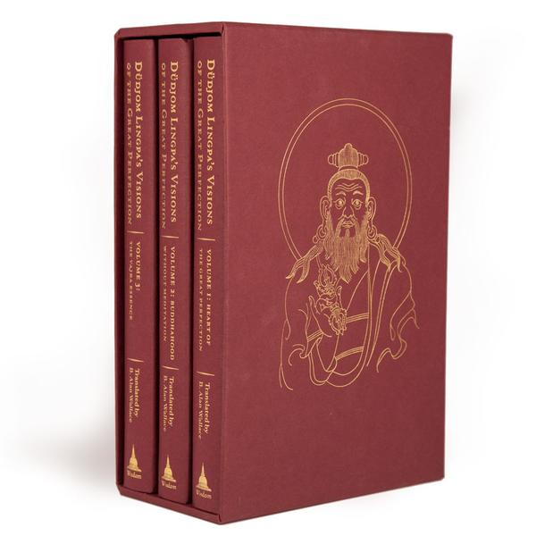

# the great perfection

[these books](https://wisdomexperience.org/product/dudjom-lingpas-visions-great-perfection/) are the coolest dhogzhen books on earth

dudjom reincarnated since this book and visits a town in oregon so i hope to meet the author and get a blessing 

this covers 5 teachings by dudjom

vol 1 is 4 books

1. [x] the sharp vajra of conscious awareness tantra - 12 pages - very condensed, requires some unpacking
1. [ ] essence of clearn meaning
1. [x] the foolish dharma of an idiot clothed in mud and feathers
1. [ ] the enlightened view of samantabhadra

* [ ] extensive glossary

vol 2

1. [ ] buddhism without meditation
1. [ ] the fine path to liberation
1. [ ] her garland for the delight of the fortunate

vol 3

1. [ ] vajra essence

## 2020-07-08

"achieve śamatha — in which the mind dissolves into the substrate consciousness and you experience bliss, luminosity, and nonconceptuality"

## 2020-05-24

1. purchased these books [books](https://wisdomexperience.org/product/dudjom-lingpas-visions-great-perfection/) and the ebooks on google play
1. [endless knot](https://en.wikipedia.org/wiki/Endless_knot)
1. [emptiness](https://en.wikipedia.org/wiki/%C5%9A%C5%ABnyat%C4%81)

## 2020-05-17 

* [ ] the foolish dharma of an idiot clothed in mud and feathers - started

### the castle

* the 3 layers of dirt foundataion
	* utilize the potential in this moment 
	* impermanence should be continuously integrated in awareness 
	* stay undistracted by understanding the nature of existence

<iframe width="560" height="315" src="https://www.youtube.com/embed/6cStkFzqbuA" frameborder="0" allow="accelerometer; autoplay; encrypted-media; gyroscope; picture-in-picture" allowfullscreen></iframe>

## 2020-05-14

* [x] the sharp vajra of conscious awareness tantra

also notes on conssciousness from this video

the scientific answer is we have no clue and so cannot even begin to define how to measure it, no clue, 

science is the observation of external objects, this might be an internal sub atomic particle, or even not a particle

* shamata currently is the telescope
* vajrayana is the science
* there is nowhere to get a phd and achieve shamata, we are on our own but it can be done

<iframe width="713" height="401" src="https://www.youtube.com/embed/UpxBilZeCUQ" frameborder="0" allow="accelerometer; autoplay; encrypted-media; gyroscope; picture-in-picture" allowfullscreen></iframe>

