# books

authors of books i read also get a page under [teachers](../teachers/)

* [currently reading](current.md)
* [plan to read](future.md) 
* [previously read](history.md)

recently i got a couple audio books i'll have to add here, listened to them through once while distracted, going to continue relistening till i feel i got a full grasp on their content, one from loch kelly, andother from dzhogchen punlop

