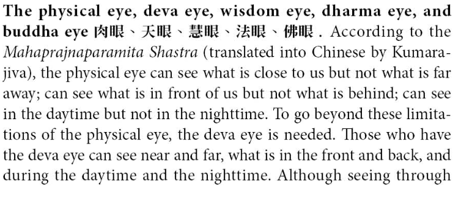

---
tags:
  - buddha eyes 
  - diamond sutra 
---

# buddha eyes

Several sutras mention the concept of the "dhamma eye," often emphasizing its role in attaining wisdom and spiritual liberation. Here are some notable examples:

1. Samyutta Nikaya:

Rathakāra Sutta (The Chariot-Maker): This sutta uses the chariot as a metaphor for the path to liberation, with the "dhamma eye" representing the crucial skill of discerning the true nature of things. It states, "Just as a skilled chariot-maker, when he has placed a new axle in an old chariot, sees with the dhamma eye: 'This axle will fit in this chariot,' so too, a monk, when he has placed the mindfulness of breathing in an unshakable concentration, sees with the dhamma eye: 'This is the way to the destruction of suffering.'"
2. Majjhima Nikaya:

Satipatthana Sutta (The Four Foundations of Mindfulness): This prominent sutta describes the practice of mindfulness meditation, including developing the "dhamma eye" through contemplation of physical and mental phenomena. It states, "So he develops the mind: 'I will develop the wisdom of the dhamma eye.'... He understands with the dhamma eye, as it actually is, the conditioned nature of things ... He understands with the dhamma eye, as it actually is, the escape from the conditioned nature of things."
3. Anguttara Nikaya:

Vīmamsaka Sutta (The Sceptic): This sutta addresses the concerns of a skeptical individual who doubts the Buddha's teachings. The Buddha encourages him to cultivate the "dhamma eye" to directly experience the truth of his words, stating, "He, having abandoned desire and aversion, develops the dhamma eye. With the developed dhamma eye, he sees directly and immediately, face to face, as it actually is, the arising and passing away of the world.”
4. Visuddhimagga:

Buddhaghosa's influential text on Theravada meditation: This manual describes the stages of attaining the "dhamma eye" through focused contemplation, leading to deeper understanding and insight into the nature of reality.
5. Pali Canon commentaries:

Various commentaries throughout the Pali Canon also elaborate on the dhamma eye, emphasizing its connection to wisdom, liberation, and the ability to discern the impermanent and ultimately unsatisfactory nature of all phenomena.
