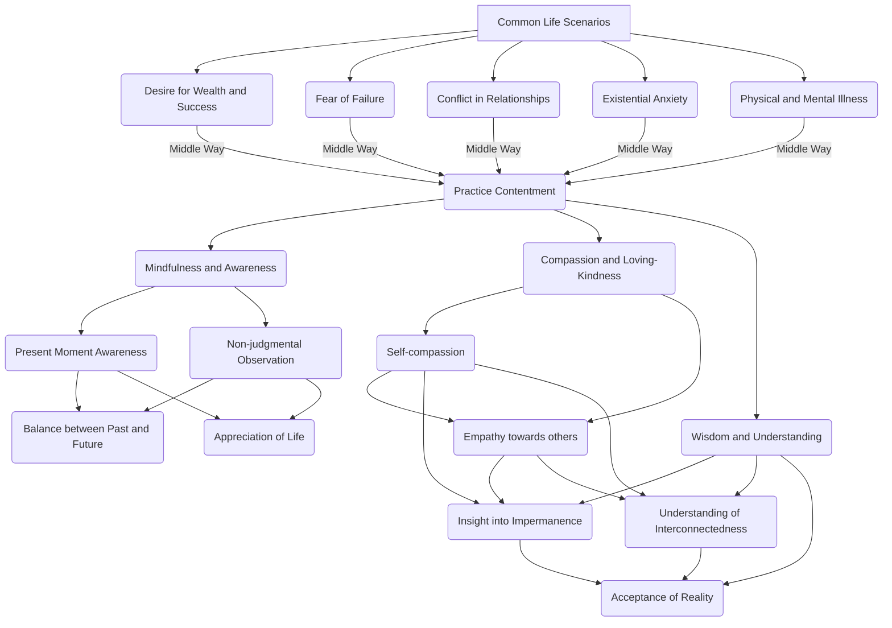

# 03 march 2024

- robot experiment
- having it generate a mermaid diagram

```mermaid
graph TD;
    A[Common Life Scenarios] --> B(Desire for Wealth and Success);
    A --> C(Fear of Failure);
    A --> D(Conflict in Relationships);
    A --> E(Existential Anxiety);
    A --> F(Physical and Mental Illness);
    B --> |Middle Way| G(Practice Contentment);
    C --> |Middle Way| G;
    D --> |Middle Way| G;
    E --> |Middle Way| G;
    F --> |Middle Way| G;
    G --> H(Mindfulness and Awareness);
    G --> I(Compassion and Loving-Kindness);
    G --> J(Wisdom and Understanding);
    H --> K(Present Moment Awareness);
    H --> L(Non-judgmental Observation);
    I --> M(Self-compassion);
    I --> N(Empathy towards others);
    J --> O(Insight into Impermanence);
    J --> P(Understanding of Interconnectedness);
    J --> Q(Acceptance of Reality);
    K --> R(Balance between Past and Future);
    K --> S(Appreciation of Life);
    L --> R;
    L --> S;
    M --> N;
    M --> O;
    M --> P;
    N --> O;
    N --> P;
    O --> Q;
    P --> Q;
```