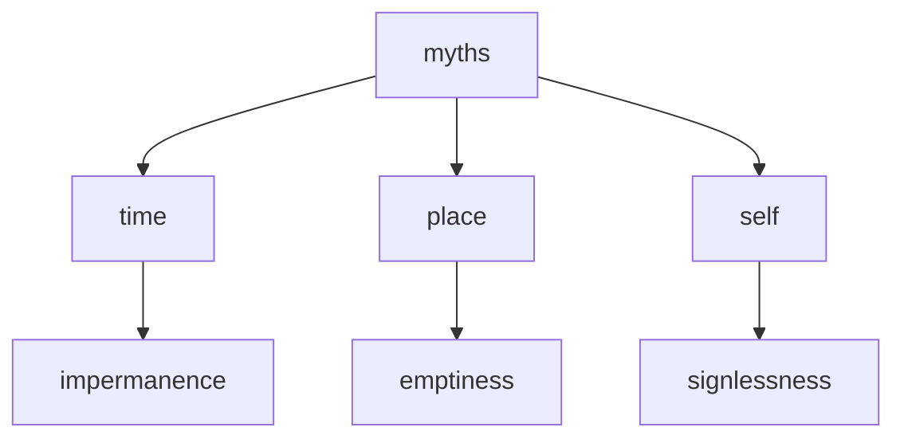

# delusion

```mermaid
graph TD
myths --> time --> impermanence
myths --> place --> emptiness
myths --> self --> signlessness
```

## three great myths

-8<- "https://raw.githubusercontent.com/shane0/shane0.github.io/main/drafts/buddhism/delusion.md:21"
