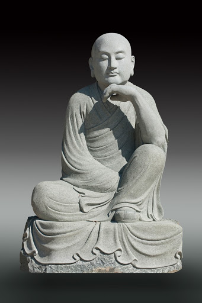

---
tags:
  - diamond sutra 
  - doing 
  - books 
---
# The Diamond Sutra

the mind becomes the diamond that can cut through all illusions and arrive on the other shore of enlightenment

this sutra is about 40 minutes read aloud

the Diamond Sutra emerged within the Mahayana Buddhist tradition in India sometime between the 2nd and 5th centuries CE.

- [audio reading](https://drive.google.com/file/d/1k8XpOOQtVXUy8AQWPMr-YlMuKCD_hBA7/view)
- [diamond sutra sutra study book](https://www.ctworld.org.tw/Buddhist%20e-Books/Books06/index.html)
- [diamond sutra](https://www.ctworld.org.tw/Buddhist%20e-Books/Books01/index.html)
- [mind seal of prajna wisdom audiobook](https://www.ctworld.org.tw/Buddhist%20e-Books/Audio/Book007/index.html){ .md-button }

<iframe width="850" height="694" src="https://www.youtube.com/embed/HK9u7Jz-vNA" title="The Diamond Sutra - spoken in English" frameborder="0" allow="accelerometer; autoplay; clipboard-write; encrypted-media; gyroscope; picture-in-picture; web-share" referrerpolicy="strict-origin-when-cross-origin" allowfullscreen></iframe>

<iframe width="1109" height="624" src="https://www.youtube.com/embed/Y5fIVLwGYI8" title="The Diamond Sutra (Vajracchedikā Prajñāpāramitā Sūtra) - Mahayana, Zen Buddhism" frameborder="0" allow="accelerometer; autoplay; clipboard-write; encrypted-media; gyroscope; picture-in-picture; web-share" referrerpolicy="strict-origin-when-cross-origin" allowfullscreen></iframe>

## tasks

- [ ] extracting only what I want to use in a simplified meditation record checklist
- [ ] extracting bulletpoints on each chapter for conceptual understanding during readings at the temple

## 1 | Convocation of the Assembly

## 2 1 Subhuti Requests the Teaching

## 3 I The Core of Mahayana' Practice

> The Buddha said to Subhuti,
>> ... ultimately, no sentient beings have been liberated. Why? Subhuti, if bodhisattvas have any notions of a self, a person, a sentient being or a life span, they are not bodhisattvas."

## 4 | Practice Charity Without Attachment

## 5 | The Way to Ultimately Recognize the Buddha

- thathagata has no physical appearance
- All appearances are illusory

## 6 | True Faith Is Precious

- it is rare someone understands the diamond sutra quickly
- if you understand the diamond sutra immediately
- you are free from the notions of a self, a person, a sentient being and a life
- you are free from the notions of dharmas and non-dharmas

## 7 1 No Attainment, No Teaching

- The Dharma taught by the Tathagata cannot be grasped or explained.
- It is neither Dharma nor non-Dharma. How is this so?
- It is because all the saints and sages are distinguished by the unconditioned dharma.

## 8 | Merits Obtained Accord with the Dharma

## 9 | All Forms Are Formless

- one who abides peacefully in non-contention

## 10 | Adorn a Buddha World

- bodhisattvas and mahasattvas should give rise to a pure mind
- that does not abide in form, sound, smell, taste, touch or dharmas

## 11 | The Merit of Unconditioned Dharma Is Great

## 12 | Revere the Teaching as Buddha

## 13 | Uphold the Sutra Accordingly

- the diamond prajna paramita is not prajna paramita therefore it is called prajna paramita

## 14 | Attain Nirvana Without Attachment

- Those who relinquish all appearances and notions are called buddhas?

## 15 | Merits of Upholding this Sutra

## 16 | Purgation of Bad Karma

## 17 | Ultimately There Is No Self

## 18 | All Is Seen in Essence

- [wisdom eye](glossary.md#buddha-eyes)

## 19 | The Way to Benefit the World

## 20 | Transcend Physical Forms and Attributes

## 21 | There Is No Dharma to Teach

## 22 | There Is No Dharma to Attain

## 23 | Cultivate the Good with a Pure Mind

## 24 | The Unsurpassed Merit of Teaching the Sutra

## 25 | Liberate Without the Notion of Liberating

## 26 | Dharma Body Is Formless

## 27 | Attainment Without Nihilistic Views

## 28 | Neither Accumulate nor Cling to Merits

## 29 | Deportment Is Always Serene

## 30 | One Wholeness in Nature

## 31 | Know and Practice Without Attachment

## 32 | All Dharmas Are Illusions

"Subhuti, if a person were to fill countless worlds with the seven jewels and give them away in charity, and if a good man or good woman, having made the bodhisattva resolve, reads, recites, studies, follows and expounds to others this sutra, even a mere four-line verse, the latter's merits far exceed the former's. How should one expound to others?
Without attachment, abiding in stillness and suchness. Why?

- All conditioned dharmas
- Are like a dream, an illusion, a bubble, a shadow, Like dew or a flash of lightning;
- Thus we shall perceive them.

With this, the Buddha concluded the sutra. The elder Subhuti, other bhikshus, bhikshunis, upasakas, upasikas," heavenly and human beings, asuras and other beings of the world, having heard the Buddha, were all filled with immense joy; they accepted and followed the teaching faith-fully.

## chinese sutra restoration

<iframe width="1109" height="624" src="https://www.youtube.com/embed/SgN5HQXTlMc" title="Conserving the Diamond Sutra" frameborder="0" allow="accelerometer; autoplay; clipboard-write; encrypted-media; gyroscope; picture-in-picture; web-share" allowfullscreen></iframe>
