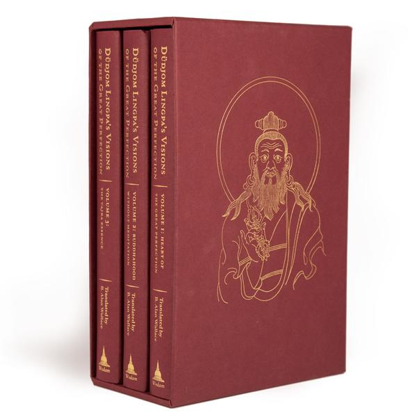

# books

books i own or recommend etc.

when i read a book typically it becomes part of my daily workflow with a checklist

## sequence

here is the general sequence of books i plan to read

| book | topic | notes |
| :--- | :--- | :--- |
| [turning confusion to clarity](confusion-to-clarity.md) | ngondro | |
| [stilling the mind](stilling-book.md) |[shamatha](../dzogchen/shamatha.md) | relaxing the mind into it's natural state |
| [fathoming the mind](fathoming.md) | [vipassana](../dzogchen/vipassana.md) | recognizing the nature of impermanent objects |
| [open mind ](open-mind.md) | [dzogchen](../dzogchen/index.md) | recognizing the deepest levels of awareness |
| [heart of the great perfection vol 1](heart-1.md) | [dzogchen](../dzogchen/index.md)| |
| [heart of the great perfection vol 2](heart-2.md) | [dzogchen](../dzogchen/index.md) | |
| [heart of the great perfection vol 3](heart-3.md) | [dzogchen](../dzogchen/index.md)  | |
| [heart of the great perfection vol 4](heart-4.md) | [dzogchen](../dzogchen/index.md)   | |
| [zen flesh zen bones](zfzb.md) | koans |i read this anytime, it's a collection of small stories and koans |
 
## khenpo sherab sangpo

* [ ] the path

## mingyur rinpoche

* [ ] [turning confusion into clarity](confusion-to-clarity.md)

## tokul urgyen rinpoche

* [ ] [as it is vol 1](as-it-is.md)
* [ ] as it is vol 2

## lerab lingpa 

* [ ] [open mind](open-mind.md) 

## dudjom lingpa 

* [x] [stilling the mind](https://play.google.com/store/books/details?id=JTA6AwAAQBAJ)
* [x] [fathoming the mind](https://play.google.com/store/books/details?id=kcVWDwAAQBAJ)
* [ ] [vajra essence](https://www.amazon.com/Dudjom-Lingpas-Visions-Great-Perfection/dp/1614293147/)
	* [ ] vol 1 
		* [x] the sharp vajra of conscious awareness tantra
		* [ ] essence of clear meaning
		* [ ] the foolish dharma of an idiot clothed in mud and feathers
		* [ ] the enlightened view of samantabhadra 
	* [ ] vol 2
		* [ ] buddhism without meditation
		* [ ] the fine path to liberation 
		* [ ] garland for the delight of the fortunate 
	* [ ] vol 3 
		* [ ] the vajra essence

## dzogchen ponlop

* [x] [emotional rescue](https://play.google.com/store/audiobooks/details?id=AQAAAIC2ukc64M)

## loch kelly

* [x] [effortless mindfullness](https://play.google.com/store/audiobooks/details?id=AQAAAEAskHnQRM) 

## zen

* [x] zen flesh zen bones
	* [ ] 101 zen stories
	* [x] the gateless gate - collection of koans 
	* [ ] 10 bulls
	* [ ] centering

## krisnamurti

??? meditation-is-not
	* verbal or visual thought and chatter 
	* it's not phony propaganda systems of authority systems repition suppression
	* it is - empty clean and highy observant - wipe the slate clean and observe the dynamic flow of existence truth is alive always changing silent not chatter

<iframe width="1029" height="579" src="https://www.youtube.com/embed/xpqC24LxWus" frameborder="0" allow="accelerometer; autoplay; clipboard-write; encrypted-media; gyroscope; picture-in-picture" allowfullscreen></iframe>
