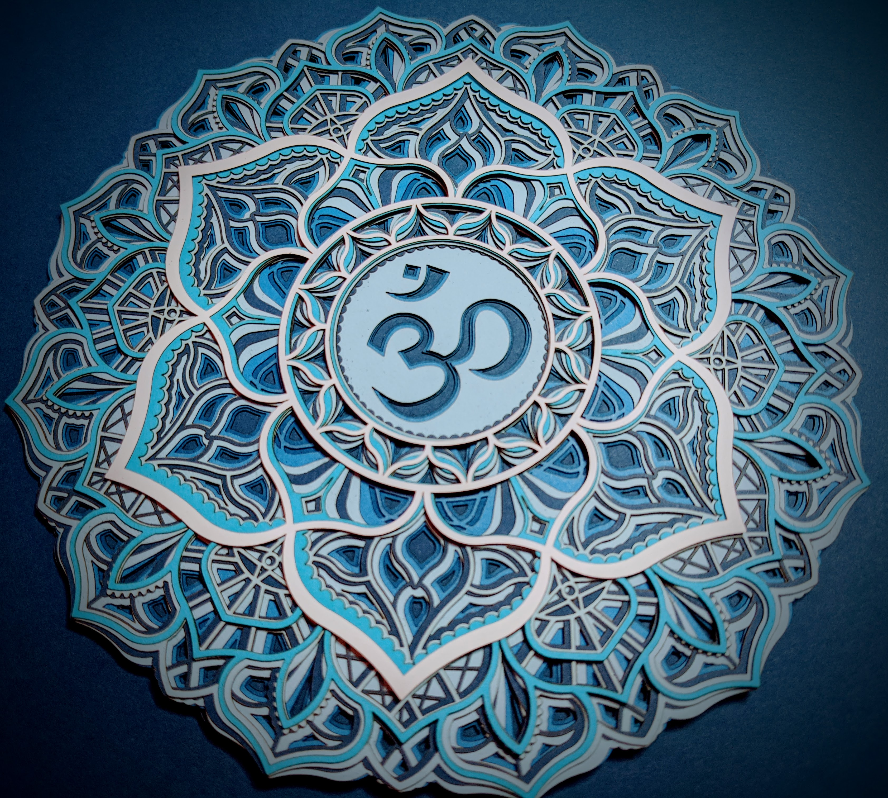

# 🙏 buddhism 🕉️

<a href=https://shanenull.com/ class="md-footer-social__link fa fa-linode"></a>

> 2021-01-24

[koans](koans/)

> 2021-01-22

<iframe width="1029" height="579" src="https://www.youtube.com/embed/xVueLvn0WYE" frameborder="0" allow="accelerometer; autoplay; clipboard-write; encrypted-media; gyroscope; picture-in-picture" allowfullscreen></iframe>

> 2021-01-05

I've narrowed down and rearanged the order of the books / practices I'm studying and taking notes, after these notes make sense I will publish them here.

* Tulku Urgyen Rinpoche - several books I've ordered and am reading currently
* Lerab Lingpa - Open Mind
* Dudjom Lingpa - Vajra Essence

## rando notes


* this entie site is a draft, it grows then shrinks regularly as i attempt to grasp this subject
	* i've only studied buddhism for a few years and specifically dzogchen, amazon sells 700 books on dzogchen, that is far too many so my main goal with this project is to sift through and find the most meaningful and see if i can achieve the claims people make for it in this lifetime
	* wish me luck ❤
* checkout the [centre for contemplate research](https://www.centerforcontemplativeresearch.org/)
* my **[daily habits](dzogchen/daily.html)**
* **[deity research](dzogchen/deities.html)**
* **Vajrayana can end widespread ignorance and replace it with compassion & enlightenment**
* **life is an energy too,  until scientific equations factor it in we will continue to learn more about dead particles than live ones**

```text
dwelling nowhere the mind comes forth
awaken your mind without fixing it anywhere 
you must separate no form from form
```

1. [ngondro](dzogchen/ngondro.md) is a tibetan word that translates to first steps and foundational, i practice that and read books on ngondro
1. [dhogzhen](dzogchen/index.md)  is tibetan for great perfection, or greatest completion, it extends ngondro even further towards wisdom and compassion, for all beings

**slide shows**

* [overview](index.html)
* [ngondro](dzogchen/ngondro.html)
* [dzogchen](dzogchen/dzogchen.html)
* [deities](dzogchen/deities.html)

## mandala

* [laser cut mandala](dzogchen/mandala/index.md) 



## guided meditations

* after reading [turning confusion into clarity](books/confusion-to-clarity.md) i briefly researched deities and wrote a deity playlist
* in 2020 i created a [buddhism youtube channel](https://www.youtube.com/channel/UCM4De0vBH5U1hs_2LVsl5hQ) to store guided meditations i create mostly for myself and they mostly repeat things i've learned from the books mentioned here

<iframe width="560" height="315" src="https://www.youtube.com/embed/videoseries?list=PLxT_zr-mrvxKouAfPiHzLR1SUX2Kxwj5s" frameborder="0" allow="accelerometer; autoplay; clipboard-write; encrypted-media; gyroscope; picture-in-picture" allowfullscreen></iframe>

## meditation music

i also write music for meditation, i wrote music before i studied buddhism 

<iframe width="560" height="315" src="https://www.youtube.com/embed/videoseries?list=PLGY2UhH7nNtJDriq1EQe3GD8WqbKHUlhE" frameborder="0" allow="accelerometer; autoplay; clipboard-write; encrypted-media; gyroscope; picture-in-picture" allowfullscreen></iframe>

