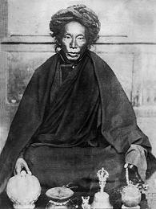

# open mind

## takeaways 

* i use this to manage equipose
	* using the vase breat tho regulate any laxity or excitation
* [my ebook](https://books.google.com/ebooks/app#reader/fUDCKAAAAEAJ/GBS.PA7)

## about 

before this i read [fathoming the mind](fathoming.md) and followed it with [heart of the great perfection vol 1](heart-1.md)

## lerab lingpa

* book [open mind](https://wisdomexperience.org/product/open-mind/) by lerab lingpa aka [Tertön Sogyal](https://www.rigpawiki.org/index.php?title=Tert%C3%B6n_Sogyal) (1856-1926)
* translated by alan wallace
* started reading this one on 2020-11-14
* other books
	* fearless in tibet

----

----

<iframe width="928" height="522" src="https://www.youtube.com/embed/_7NNkc7OExA" frameborder="0" allow="accelerometer; autoplay; clipboard-write; encrypted-media; gyroscope; picture-in-picture" allowfullscreen></iframe><iframe width="928" height="522" src="https://www.youtube.com/embed/_7NNkc7OExA" frameborder="0" allow="accelerometer; autoplay; clipboard-write; encrypted-media; gyroscope; picture-in-picture" allowfullscreen></iframe>

----

