# dzogchen

aka atiyoga aka great perfection aka great completion

analogy: the final summit of mt everest, with [ngondro](ngondro.md) being [basecamp](https://en.wikipedia.org/wiki/Everest_base_camps)

* [dzogchen slide](dzogchenslides.html)
* [wiki page](https://www.rigpawiki.org/index.php?title=Dzogchen)
* [tantra](https://www.rigpawiki.org/index.php?title=Dzogchen_Tantras)

## triad

in dzogchen the meditation comes before the view

[lectures](http://contemplative-consciousness.net/summary-view-meditation-conduct/)

### view

pristine awareness vast unlimited

### meditation

cutting through to pristine awareness aka open awareness[^6]

### conduct

dream like - do not confuse the wide view with the close conduct

<iframe width="1200" height="480" src="https://www.youtube.com/embed/elfT3kj3imU" frameborder="0" allow="accelerometer; autoplay; clipboard-write; encrypted-media; gyroscope; picture-in-picture" allowfullscreen></iframe>

## nine yanas[^5]

**dzogchen is atiyoga #9**

1. [Shravaka_yana](https://www.rigpawiki.org/index.php?title=Shravaka_yana)
1. [Pratyekabuddha_yana](https://www.rigpawiki.org/index.php?title=Pratyekabuddha_yana)
1. [Bodhisattva_yana](https://www.rigpawiki.org/index.php?title=Bodhisattva_yana)
1. [Kriya_Tantra](https://www.rigpawiki.org/index.php?title=Kriya_Tantra)
1. [Charya_Tantra](https://www.rigpawiki.org/index.php?title=Charya_Tantra)
1. [Yoga_Tantra](https://www.rigpawiki.org/index.php?title=Yoga_Tantra)
1. [Mahayoga](https://www.rigpawiki.org/index.php?title=Mahayoga)
1. [Anuyoga](https://www.rigpawiki.org/index.php?title=Anuyoga)
1. [Atiyoga](https://www.rigpawiki.org/index.php?title=Atiyoga)

| stage | books | notes |
| :--- | :--- | :--- |
| [ngondro](ngondro.md) | [tcic](../books/confusion-to-clarity.md) | 4 common and unique foundation practices |
| [shamatha](shamatha.md) | [stilling the mind](../books/stilling-book.md) | abide in the calm nature of mind and balance the still mind tuned between laxity and excitation |
| [vipassana](vipassana.md) | [fathoming the mind](../books/fathoming.md) | recognize sunyata |
| [12 links](https://www.rigpawiki.org/index.php?title=Twelve_links_of_dependent_origination) | | |
| [37 factors](https://www.rigpawiki.org/index.php?title=Thirty-seven_factors_of_enlightenmentj) | | |
| [6 deity aspects](https://www.rigpawiki.org/index.php?title=Six_aspects_of_the_deity) | | |
| [samayasattva](https://www.rigpawiki.org/index.php?title=samayasattva) | | |
| [jnanasattva](https://www.rigpawiki.org/index.php?title=jnanasattva) | | |
| [visualization](https://www.rigpawiki.org/index.php?title=visualization) | | |
| [four mudras](https://www.rigpawiki.org/index.php?title=) | | |
| [generation](https://www.rigpawiki.org/index.php?title=generation) | | |
| [completion](https://www.rigpawiki.org/index.php?title=completion) | | |
| [samadhi](https://www.rigpawiki.org/index.php?title=samadhi) | | |
| [mandala](https://www.rigpawiki.org/index.php?title=mandala) | | |
| [cutting through](https://www.rigpawiki.org/index.php?title=) | | |

## charts

### ngondro

### dzogchen

dzogchen is the 9th yana aka atiyoga

## generation stage

source rigpa wiki?

* vipassana
* emptiness
* forms as nirmanakaya
* sounds as emanations of sambhogakaya
* mental events as dharmakaya
* own body as body of buddha
* own speech as speech of buddha
* own mind as mind off buddha

## buddha nature

recognition not creation this already exists in humans

* primordial liberation
* primordial awareness
* pristine awareness

## motivations

1. enlightenment of all beings
1. shamatha 
	* recognition of the nature of mind
		* bliss 
		* illuminosity 
		* compassion
1. vipassana
	* removes delusions
	* recognition of the nature of reality

## three words[^4]

1. relax and detach the mind - recognize and let it settle into it's nature - buddha nature - tathagatarba 
	1. dharmakaya - emptiness
	1. sambhogakaya - cognizant nature 
	1. nirmanakaya - union of the two 
1. decide on one point
1. gain confidence in liberation

## three kayas

[rigpa wiki](https://www.rigpawiki.org/index.php?title=Three_kayas)

1. dharmakaya
	* inherent truth
1. sambhogakaya
	* it's nature light or energy
1. nirmanakaya
	* everything we perceive

??? dhogzhen
	dhogzhen meditation is also called nonmeditation
	tibetan rig pa chok shak means open presence in pristine awareness
	translates to the great perfection or completion
	cuts through the ordinary conditioned mind	
	perceiving reality from the perspective of pristine awareness

??? vajra-essence
	1. taking the mind as the impure path
		* shamatha - fathoming page 23 lists 3 steps
			* relaxed - no agitation
			* stable - equipose - equanimity increasingly
			* vivid actuity of attention without undermining stability 
			* padmasambhava says practicing being aware of awareness may be all that is needed to achieve shamata and cut tthrough to pristine awareness 
	1. revealing your own face as the sharp vajra of vipasyana 
		* the nature - devoid of any origin location and destination
		* four chokshyaks - there is nothing to crave or change in this moment everything needed is already there
		* cultivate increasing awareness of projections or rejections 
		* generation stage - see charts
		* superior faculties can merge their mind with space for 21 days and cut through to pristine awareness 
	1. revealing the ground dharmakaya
		* dissolution of self reveals the ground
	1. determining the charactistics and qualities of the [ground](https://www.rigpawiki.org/index.php?title=Ground)
		* wake up pay attention dwell in samadhi

??? ahamkara
	ahamkara aka i-maker is the primitive preconceptual state of being separate
	sensation of being right here
	separate from objects seen as other over there
	mentation - mentation - manas emerge and afflictive mentation aka klistamanas
	conceptualization arises and grasping and rejecting objects get categorized and isolated 
	ignorance causing delusion about what is self and what objects are

??? russian-dolls
	* alan wallace's russian doll anaology
	* normal awareness - not meditating
	* russian doll of attention fixated on the body falls away
		* aware of being aware - meditative state
		* aware of the breath while noting & releasing adventitious mental factors as they arise
	* russian doll of attention fixated on the mind falls away
		* 
		* 
	* innermost russian doll is pristine awareness 
		* non conceptual
		* wisdom - radiance illuminates 
		* non duality - ta signifies emptiness
			* sunyata - emptiness 
			* dharmata - suchness arises from emptiness

## definitions

[dzogchen jargon](definitions.md)

## videos

<iframe width="560" height="315" src="https://www.youtube.com/embed/7Xyikn0_IWU" frameborder="0" allow="accelerometer; autoplay; clipboard-write; encrypted-media; gyroscope; picture-in-picture" allowfullscreen></iframe>

<iframe width="928" height="522" src="https://www.youtube.com/embed/nWvY-05OA90" frameborder="0" allow="accelerometer; autoplay; clipboard-write; encrypted-media; gyroscope; picture-in-picture" allowfullscreen></iframe>

<iframe width="928" height="522" src="https://www.youtube.com/embed/o23bYf59ZtE" frameborder="0" allow="accelerometer; autoplay; clipboard-write; encrypted-media; gyroscope; picture-in-picture" allowfullscreen></iframe>

* nature
* essence
* expression

primordial awareness is buddhahood it is empty therefore pure and permanently unoccluded

this feature is what allows complete humans to achieve buddhahood and it cannot be lost due to the nature of the mind

[^1]:turning confusion into clarity page ?
[^2]:stilling the mind 
[^3]:fathoming the mind p.21-22
[^4]:[Garab Dorje](https://www.rigpawiki.org/index.php?title=Garab_Dorje#Three_Statements)
[^5]:[nine yanas](https://www.rigpawiki.org/index.php?title=Nine_yanas)
[^6]:fathoming the mind p.67
