# shamatha 

[rigpa wiki shamatha page](https://www.rigpawiki.org/index.php?title=Shamatha)

[draft of a shamatha slide](shamatha.html)

"achieve śamatha — in which the mind dissolves into the substrate consciousness and you experience bliss, luminosity, and nonconceptuality" 

-- Alan Wallace from his book Heart of the Great Perfection

"shamata - calm abiding. refers to a mind that abides in its own steadiness. independent of external circumstances. cultivated through meditative awareness." 

-- Mingyur Rinpoche from his book Turning Confusion into Clarity 

## two divisions[^1] 

1. with objects
	1. breath sensation - instructions from stilling the mind 
		1. nostrils
		1. throat
		1. chest
		1. abdomen
	1. breath - nstructions from khenpo
		1. in relaxed	
		1. out release thoughts or tension	
	1. mind
		1. observe - coarse focused concentrated tense
		1. release observation and relaxed subtle
	1. awareness of awarenessask 
		1. ask what is the agent that releases and concentrates the mind?
1. without objects
	1. rest in the naturally calm mind
	1. rest in vipashyana

dzogchen has it's own styles of shamatha - heart of the great perfection

note: the end goal is to maintain this permanently, not just while you're on your cushion

like most meditations you are not **creating** shamatha, you simply **recognize** it, it is a natural state of mind if you allow the mind to settle

to achieve shamata you might need to try a long retreat

## russian doll analogy

Alan Wallace uses this analogy, if your mind were nested like Russian dolls that open to reveale inner qualities

* awarenss of the body is the outer doll
* awareness of space of the mind is next
* pristine awareness is the inner most doll

## 9 stages

## isolation from the body[^2]

focusing on the sensations of the respiration throughout the entire body

on the sensations of the rise and fall of the abdomen with each in-breath and out breath 

on the sensations of the breath at the nostrils

observe closesly but in a way separated detatched vs identified with the body

analogous to the Vajrayana practice known as "isolation from the body."

## isolation from speech[^2]

Düdjom Lingpa's Vajra Essence

taking the impure mind as the path

settling the mind in its natural state

observing the movements of thoughts rather than identifying with them

analogous to the Vajrayana practice of isolation from the speech."

## awareness of awarenes[^2]

Natural Liberation: Padmasambhava's Teachings the Six Bardos

* gaze into the space in front of you
* concentrate your consciousness in the space in front of you
* relax 
* What is that consciousness that is concentrating?
* in all your activities, rely upon unwavering mindfulness
* repeat alternating

## shamatha guided meditations

shamatha meditation playlist <https://www.youtube.com/playlist?list...>

<iframe width="560" height="315" src="https://www.youtube.com/embed/7Xyikn0_IWU" frameborder="0" allow="accelerometer; autoplay; clipboard-write; encrypted-media; gyroscope; picture-in-picture" allowfullscreen></iframe>

<iframe width="560" height="315" src="https://www.youtube.com/embed/videoseries?list=PLxT_zr-mrvxKHvyGI7onvx355UUJ6avtZ" frameborder="0" allow="accelerometer; autoplay; clipboard-write; encrypted-media; gyroscope; picture-in-picture" allowfullscreen></iframe>

## index

## turning confusion into clarity

* shamata (calm abiding), 10-11, 59, 233
	* on emptiness, 154-57
	* imagination practice and, 181, 274
	* in mandala practice, 283 
	* with object, 4 4-45, 199
	* in Vajrasattva practice, 240-41, 247 , 254
	* without support, 42 ,199-200
	* working with karma in, 121

### stilling the mind

### fathoming the mind

### heart of the great perfection 

[^1]:turning confusion to clarity - mingyur rinpoche
[^2]:stilling the mind - alan wallace 
