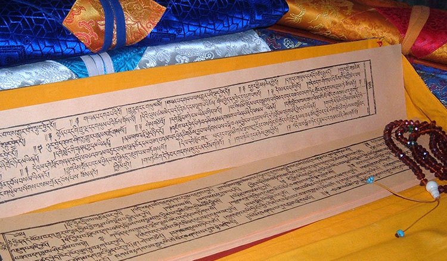

# sadhana

[Sadhana](https://www.rigpawiki.org/index.php?title=Sadhana), aka pencha text,  is a ritual text presenting the means to accomplish one of several [deities](https://www.rigpawiki.org/index.php?title=Deity).

i write my own sadhana texts combining things i learn through reading books listed on this site on zen, dzogchen, psychology etc.

## outline

* identifications
	* unbound cognizant space
	* unity with the experience
	* objectless cognizance bound to an evolved composite organism that is in the 3 times
	* 

* differentials
	* the practice & distraction [^2]
	* sem & rigpa[^3]
	* empty basic space & emptiness (mental constructs)[^4]
	* the field of perception & the conditioned illusory self
	* form & no form [^1]
	* sensations & perceptions[^5]
	* conditioned conceptual thoughts and words & non conceptual[^6]

[^1]: diamond sutra
[^2]: natural liberation
[^3]: vajra speech 
[^4]: rupert spira 
[^5]: lama lena 
[^6]: forgot where i saw this 

## glossary 

* [rigpa](https://www.rigpawiki.org/index.php?title=Rigpa)
* [sem](https://www.rigpawiki.org/index.php?title=Ordinary_mind)
* [samadhi](https://www.rigpawiki.org/index.php?title=Samadhi)
* [Sadhana](https://www.rigpawiki.org/index.php?title=Sadhana)
* [deities](https://www.rigpawiki.org/index.php?title=Deity)

