# shamatha 

picture someone eating a sandwich in the mountains, they hear a rockslide and quickly look up, observe boulders falling, they take
 a few steps and avoid the boulders and continue enjoying sandwich as if it never happened, that is shamatha

like most meditation you are not creating shamatha, you simply recognize it, it is a natural state of a mind that is liberated from laxity and excitation

after you achieve all 9 stages your mind can stay permanently calm despite your circumstances

[rigpa wiki shamatha page](https://www.rigpawiki.org/index.php?title=Shamatha)

## russian doll analogy

Alan Wallace uses this analogy, if your mind were nested like Russian dolls you liberate the inner doll

* awarenss of the body is the outer doll
* awareness of space of the mind is next
* pristine awareness is the inner most doll
	* free from the 8 extremes of conceptual elaborations

## 9 stages

## isolation from the body

focusing on the sensations of the respiration throughout the entire body

on the sensations of the rise and fall of the abdomen with each in-breath and out breath 

on the sensations of the breath at the nostrils

observe closesly but in a way separated detatched vs identified with the body

analogous to the Vajrayana practice known as "isolation from the body."

## isolation from speech

Düdjom Lingpa's Vajra Essence

taking the impure mind as the path

settling the mind in its natural state

observing the movements of thoughts rather than identifying with them

analogous to the Vajrayana practice of isolation from the speech."

## awareness of awareness

Natural Liberation: Padmasambhava's Teachings the Six Bardos

* gaze into the space in front of you
* concentrate your consciousness in the space in front of you
* relax 
* What is that consciousness that is concentrating?
* in all your activities, rely upon unwavering mindfulness
* repeat alternating

## shamatha guided meditations

<iframe width="560" height="315" src="https://www.youtube.com/embed/videoseries?list=PLxT_zr-mrvxKHvyGI7onvx355UUJ6avtZ" frameborder="0" allow="accelerometer; autoplay; clipboard-write; encrypted-media; gyroscope; picture-in-picture" allowfullscreen></iframe>

