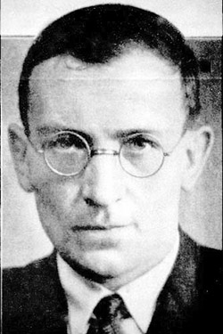

# Edward Conze

- I found Edward in 2024 when I was searching for english translations of the Diamond Sutra
- he's an amazing translator
- he writes easily readable content this is an extremely rare ability 
- makes me wonder if he was familiar with Richard Feynman

## Buddhism Essence & Development

> From another point of view emptiness is called Suchness, because one takes reality such as it is, without superimposing any ideas upon it.
