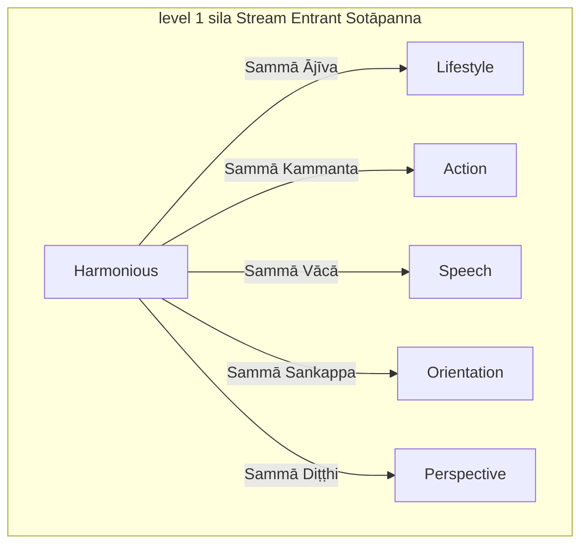
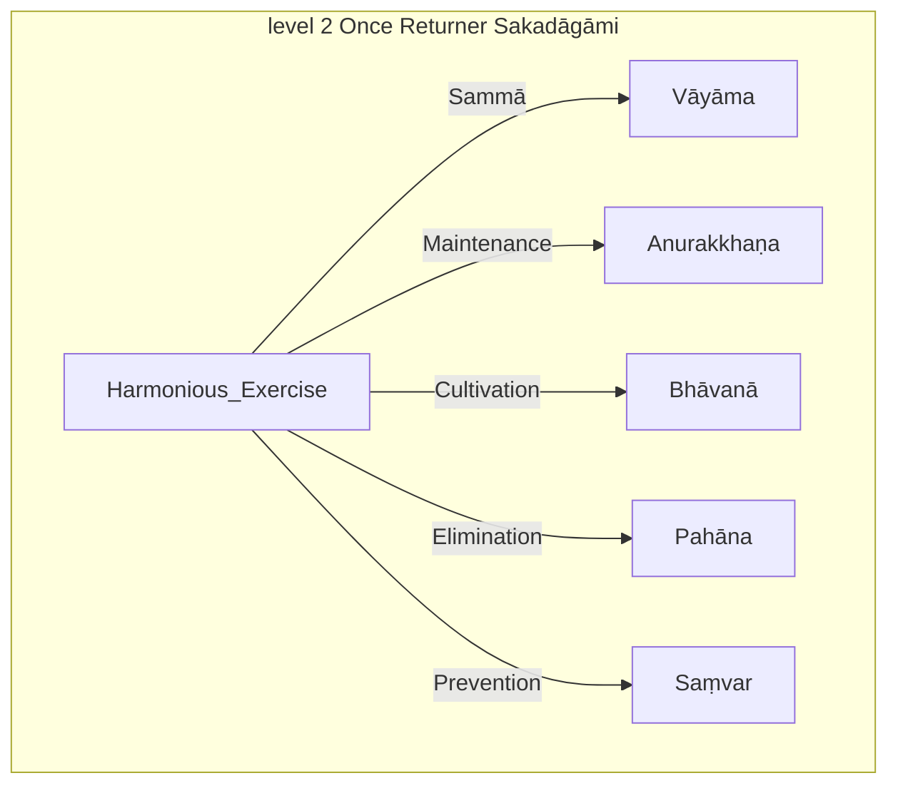
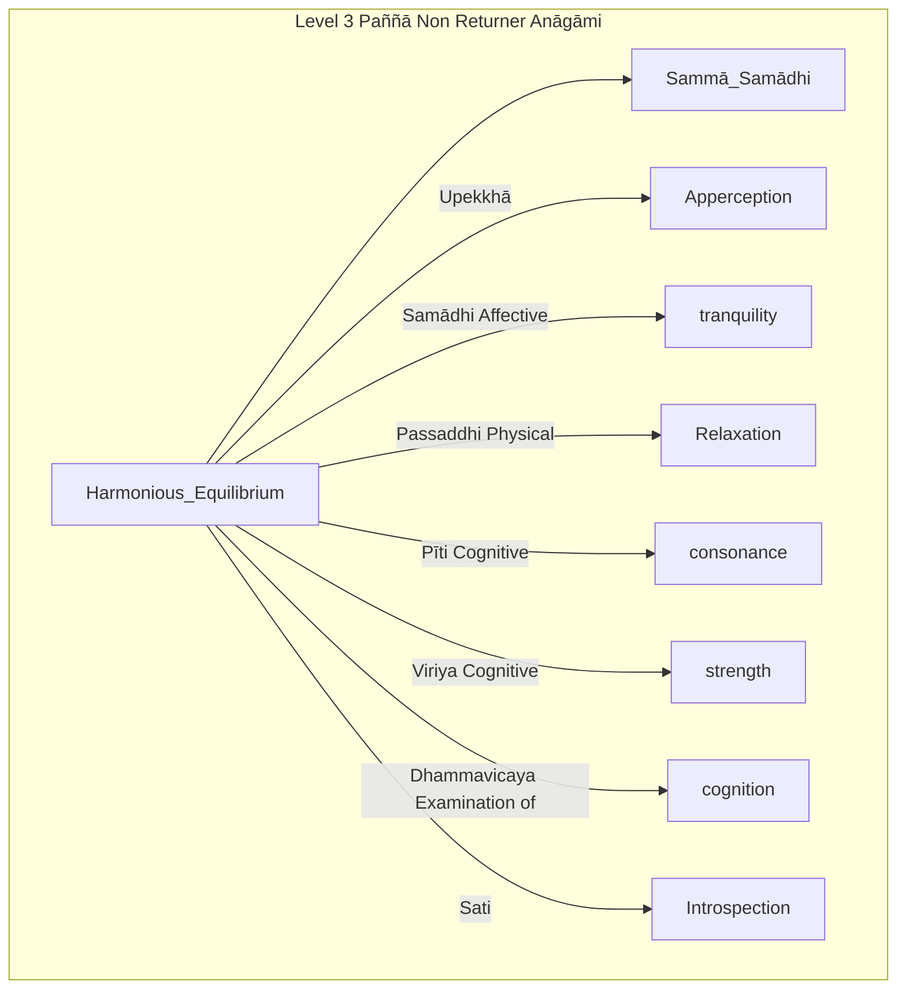
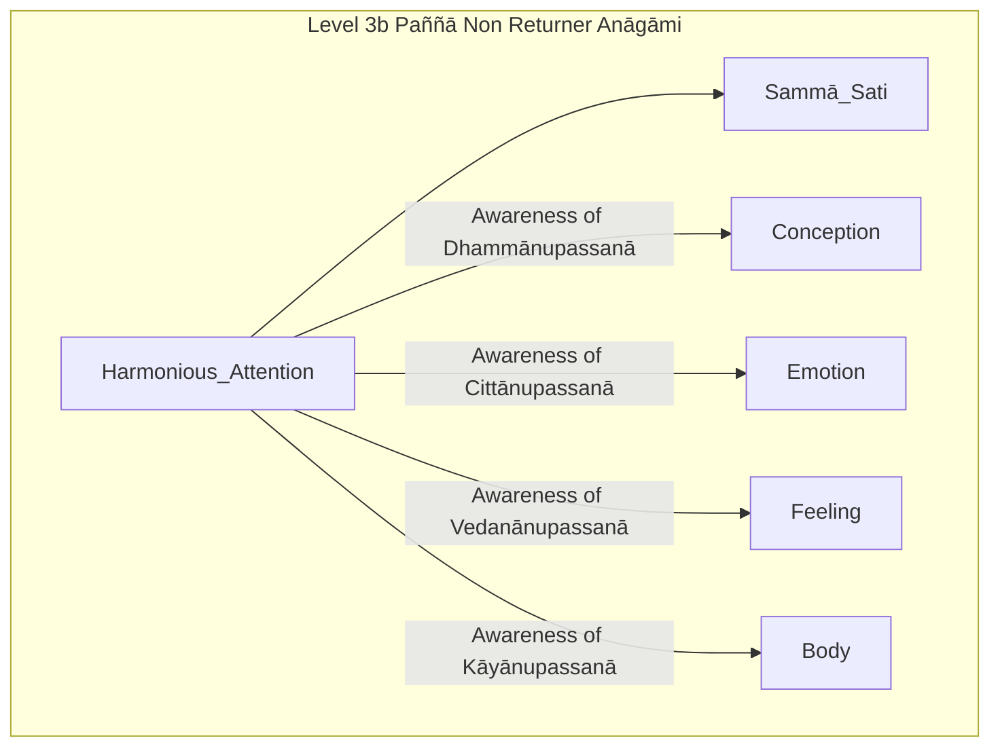
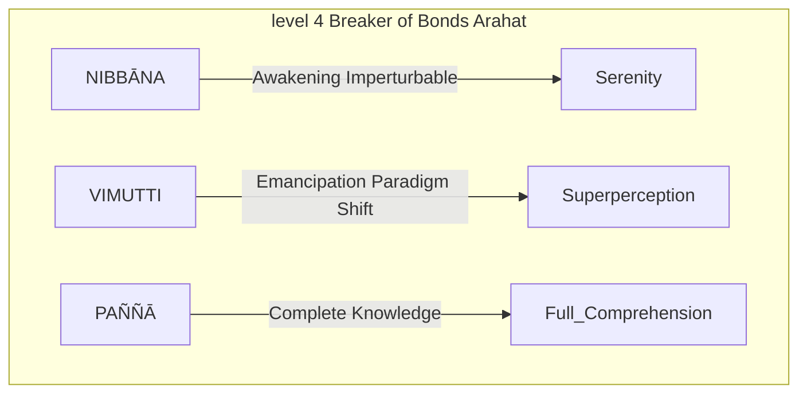

---
tags:
  - level 1 
  - magga 
  - eightfold path
---
# eightfold path

> The Eightfold Path is a core Buddhist teaching that explains how to end suffering. It is a path of moral conduct, mental discipline, and wisdom. The eight elements of the path are:

- **Right understanding:** Seeing the world as it really is, without our own biases and judgments.
- **Right thought:** Having thoughts that are kind, compassionate, and wise. <https://www.ctworld.org.tw/Buddhist%20e-Books/CTM/CTM207GM/index.html>
- **Right speech:** Speaking in a way that is honest, helpful, and truthful.
- **Right action:** Acting in a way that is ethical, moral, and harmless.
- **Right livelihood:** Working in a way that is honest and does not harm others.
- **Right effort:** Making an effort to develop positive qualities and eliminate negative qualities.
- **Right mindfulness:** Being aware of our thoughts, feelings, and bodily sensations in the present moment.
- **Right concentration:** Focusing our minds on a single object or task.

> The Eightfold Path is not a linear process. Instead, it is a holistic approach to living a good and meaningful life. By practicing all eight elements of the path, we can develop the wisdom and compassion necessary to end suffering.

## bhante

<iframe width="769" height="577" src="https://www.youtube.com/embed/UZNxbEKf6LA" title="Supernormal Eightfold Way by Bhante Punnaji 19-June-2017" frameborder="0" allow="accelerometer; autoplay; clipboard-write; encrypted-media; gyroscope; picture-in-picture; web-share" allowfullscreen></iframe>

- [pdf](pdf/EIGHTFOLD-WAY_June2017.pdf){ .md-button }

