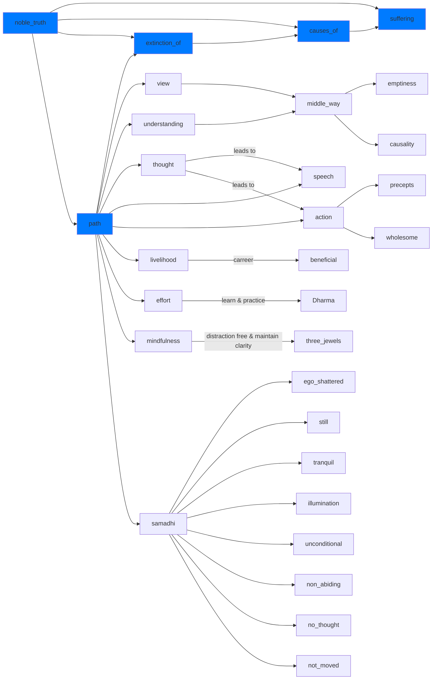

---
tags:
  - level 1 
  - magga 
  - eightfold path
---
# eightfold path

- level 1 ch 15 p 85

## this path the 4th noble truth

- view: Seeing the world as it really is, without our own biases and judgments.
- understanding: Seeing the world as it really is, without our own biases and judgments.
- thought: Having thoughts that are kind, compassionate, and wise. <https://www.ctworld.org.tw/Buddhist%20e-Books/CTM/CTM207GM/index.html>
- speech: Speaking in a way that is honest, helpful, and truthful.
- action: Acting in a way that is ethical, moral, and harmless.
- livelihood: Working in a way that is honest and does not harm others.
- effort: Making an effort to develop positive qualities and eliminate negative qualities.
- mindfulness: Being aware of our thoughts, feelings, and bodily sensations in the present moment.
- concentration: Focusing our minds on a single object or task.

## right view or right understanding

right view or right understanding is the compass that points us in the right direction on our path of cultivation.

it means developing the right view about ourselves and the world, which essentially involves understanding the principle of causality, emptiness[^1], and the middle_way[^2]

with right understanding, we will be able to discern distorted views and futile speculations from the truth. for example, the following views reflect right understanding:

- understanding that seeking sensual pleasures and attempting to satiate the ego will lead to suffering instead of true, lasting happiness.
- understanding that self-centeredness will eventually bring adversity into own our lives, while benefiting others is to benefit ourselves, and vice versa.
- realizing that all phenomena are empty in nature; they do not have an independent existence or inherent, fixed charac-teristics.
- seeing all things and all beings as interdependent and inter-connected.
- realizing that all beings are essentially equal in their original nature.

[^1]: emptiness: an important buddhist teaching that shows all phenomena, including what we perceive as our "self" are without an independent existence or inherent, fixed characteristics; therefore all things are impermanent, changing, and interdependent

[^2]: the middle way: an important buddhist teaching that describes reality as it is, free of dualistic views. emptiness and the middle way will be discussed in more detail in level 3.

## diagram

