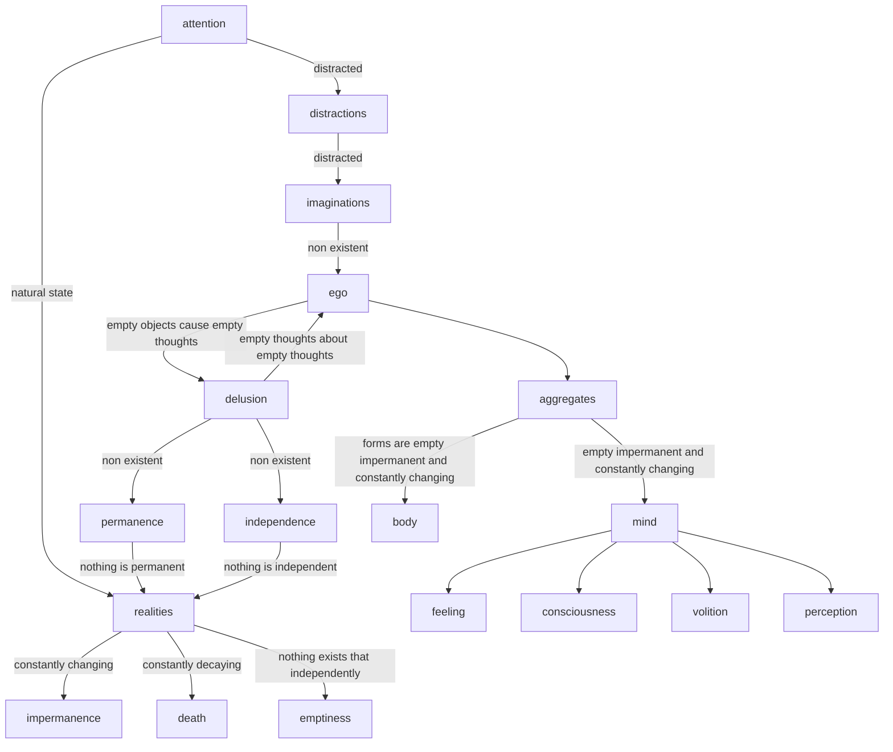

# emptiness

<iframe width="842" height="474" src="https://www.youtube.com/embed/y5JqHRTLdhY" title="Lama Zopa Rinpoche ~ Impermanence and Emptiness ~ Mahayana Buddhism" frameborder="0" allow="accelerometer; autoplay; clipboard-write; encrypted-media; gyroscope; picture-in-picture; web-share" allowfullscreen></iframe>

## transcript

- Bring your attention away from  distractions and imaginations Back to the realities of life the nature of which is impermanence and death
- Awareness of death helps free our mind  from delusion and Karma so that we can  not only bring an end to the entire  round of suffering the cycle of death  and rebirth but also eradicate  even the the subtle eras of mind
- thereby attaining Enlightenment  for the sake of all sentient beings
- All causative phenomena; our life, our body, our  mind, our self, our possessions, our relatives and  
- friends all other people are changing not only day by day minute by minute  
- and second by second but every tiny moment  they do not last for a fraction of a second
- Because they are under the control of  causes and conditions they are in a  
- state of constant decay and can cease at any time
- This is the nature of our life
- If we can remain aware of this we will prevent our  mind from coming under the control of the delusion
- The disturbing emotional minds that hurt  us and other sentient beings which prevent  us from transforming our mind and gaining  realizations of the path to Enlightenment
- They stop us from seeing the  ultimate nature of all phenomena
- First we stop delusions from manifesting
- We free ourselves of disturbing  thoughts immediately experience  peace and satisfaction and then  by actualizing the remedial path  
- we eradicate even the imprints that  they have left on our mental continuum By destroying the seeds of delusion we attain  nirvana
- ultimate Liberation from the  six Realms of suffering and its cause - freedom from the circling  aggregates which are samsara itself
- These are the benefits of  mindfulness of impermanence
- Contemplate on this
- Now meditate on emptiness
- The actual nature of all phenomena
- Think how your 'I', actions,  objects and in fact all phenomena
- Everything that is called such and  such and this and that are just names
- Names have to come from the mind they don't exist from their own side
- Names are labels applied by the mind
- However it is not just that phenomena are  labeled by the mind they are merely labels
- In other words, all phenomena, 'I', action,  object, everything are merely labeled by the  mind in relation to their base think about this
- When we come to meditate on  emptiness the practice has to be deep
- Our mindfulness meditation should be  more than just watching what we are doing
- What we really need to do  is to watch our motivation
- The practice has to be more profound than  simply noting or recognizing I'm  walking I'm sitting and so forth
- But if we don't watch our mind carefully then  we don't know what's motivating our actions
- What we should be doing is  detecting negative motivation
- The cause of suffering and  changing it into positive
- You should be applying your meditation like  a medicine to the eradication of harmful  thoughts the delusions the disturbing  emotions that harm yourself and others
- You need to eradicate these and make your  mind healthy and your attitude beneficial
- Just as the Buddha explains  in the following verse:
- Do not engage in any harmful actions  perform only those that are good
- Abandon non virtue the cause of suffering  and practice virtue the cause of happiness
- Transform negative motivation into positive  so that your actions will become virtuous
- In this way you will not waste  your life but make it meaningful
- At least you won't be harming yourself or others
- The way to practice more meaningful  mindfulness meditation in order to  understand emptiness is like this
- When you're sitting or when you're walking  ask yourself the question what am I doing?
- Then your mind will answer - I'm sitting,  
- I'm walking, I'm eating depending  on what it is that you're doing
- Whatever you are doing you  can meditate on emptiness
- One way in which you can do this this is to reply  to the answer I'm walking with another question:
- Why do I say I'm walking?
- Then you analyze, you look for the reason
- What you find is the only reason reason I say this  is that my aggregate of body
- the base I label 'I' is walking
- Your body is walking - just because of that  your mind labels and believes I'm walking
- After you've done that check how your  'I' appears to you at that moment
- Is it the same as before  or has there been a change?
- Usually you'll find that it's not the  same that there's been a definite change
- Suddenly the old view of a real I in your body,  the I you have always believed to be there in your  body has vanished become non-existent
- And that's the truth
- It's not a false view
- The old 'I' was the false one
- When you do not meditate or analyze the  I that appears to you and in which you  
- believe the eye that seems to comprise these  aggregates in this body is the false one
- In Western psychological terms  we call it the emotional I  
- The emotional I - the one that you believe  is in your body or comprises your aggregates
- is totally nonexistent
- This is what you have to discover that it's empty
- You have to discover that  it is totally non-existent
- Totally empty
- If you can realize that that there's not  even the slightest atom of an I there and  feel as if you yourself have become totally  non-existent you have entered the middle way
- At that time when you realize emptiness  you gain full conviction or definite  
- understanding that you can attain liberation
- You can cease all suffering and its cause
- Remain in the state of your discovery  of the absence of the emotional I
- Keep your mind in the emptiness of that
- When your mind gets distracted  again ask yourself the question:
- What am I doing?
- Then when your mind replies ask again:
- Why do I say I'm doing?
- There's no reason other than the labels
- If the answer is "I'm meditating" ask  yourself why do I say I'm meditating
- There's no reason other  than the fact that the base,  the aggregates of Mind are  transforming into virtue
- Which is what meditation really means
- Then check again to see what effect  this has had on your perception of 'I'
- Has there been a change or not?
- Doing this meditation again and again helps  you see the false I more and more clearly
- The more clearly you see the false I,  the emotional I, the I that doesn't  truly exist - the more clearly you see
- The better you recognize emptiness  the better idea of emptiness you get
- The awareness that recognizes emptiness  and the nature of phenomena is mind
- The awareness that recognizes  things is not the 'I'
- it is neither the real I nor  even the merely labeled I
- What it is however is merely labeled by the mind
- Therefore, the reality of the I that  is merely labeled by the mind is  
- that it exists is but it is totally  empty of existing from its own side
- While it is empty of existing from  its own side the I still exists
- How?
- In mere name only
- When you realize this you have gained  an unmistaken realization of emptiness
- On the single object 'I' you are able  to unify dependent arising and emptiness
- When you realize these two without division you  have gained an unmistaken realization of emptiness
