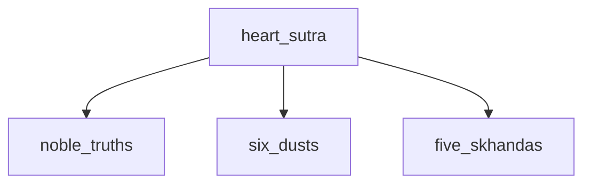
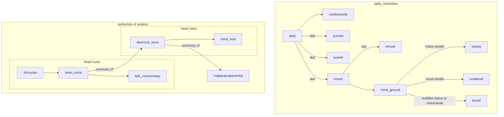

---
tags:
  - books 
  - six paramitas
  - three jewels
  - heart sutra 
  - diamond sutra 
  - mahaprajnaparamita
  - millers law 
  - evening ritual 
  - ritual 
---
# morning & evening ritual

- 3 fold: meditate - study the dharma - meritorous practice

## meditate

- [mind ground meditation](mind_ground.md){ .md-button }
- [experimental meditation record](https://forms.gle/QDPYuevc5a95QJA37){ .md-button }

## study

- [books](books.md)
- [3 jewels](https://shanenull.com/buddhism/2023/three_jewels/)
- [6 paramitas](six_paramitas.md)
- [heart sutra](heart_sutra.md)
- [diamond sutra](diamond_sutra.md)
- [mahaprajnaparamita](prajna_paramita.md)

## meritorous practice

## density level

- the heart sutra is memorized & diagrammed
- chunks: noble truths five skhandas six dusts
- could I memorize the diamond sutra? exceeds millers law but I might try it
- [millers law](https://en.wikipedia.org/wiki/The_Magical_Number_Seven,_Plus_or_Minus_Two)

## diagrams

## mind ground meditation

- this meditation gets to the point
- the heart sutra is a summary of the diamond sutra
- all I do on a busy day is the heart sutra
- on a long day I review everything on this page and try to keep it brief
- the diamond sutra is a summary of the mahaprajnaparamita
- the mahaprajnaparamita is 600 scrolls

## note

-
- this information is thousands of years old & has traveled through many translations
- if you are new to buddhism I'm not sure this will make sense for a while
- it would work but it helps to have some basic understanding
- I plan to write up some basics that should be learned
- some of it is scattered throughout this site over the years there is a dropdown menu to switch years
- the main problme is there is a lot of jargon and words that do not translate to english

## maranasati

- pretend you have one minute left
- [2024 page maranasati](https://shanenull.com/buddhism/2024/maranasati/)
- [2023 page maranasati](https://shanenull.com/buddhism/2023/maranasati/)
- [remove the false views](https://shanenull.com/buddhism/2024/samudaya/#false-views)

## prajna paramita

- gratitude: be happy you & your family are still breathing
- [mind ground[(https://shanenull.com/buddhism/2024/mind_ground/)
- [heart sutra](https://shanenull.com/buddhism/2024/heart_sutra/)
- [anapanasati](https://shanenull.com/buddhism/2023/anapanasati/)
- [diamond sutra](https://shanenull.com/buddhism/2024/diamond_sutra/)
- [satipathana - requires login](https://shane0.pythonanywhere.com/meditation/meditation/10)

## body

- [upa yoga](https://youtu.be/Jf5qUhz-FVk)
- deadlifts or squats <https://youtu.be/HLha33SzaaU>

## videos

- take notes as you listen to these
- this bach song is played at the end of cormac mccarthy's audiobook stella maris - cormac has a page here
- maranasati is the king of meditations and can be used to identify what you cling to
- if you die tonight is there anything you will cling to or anything left undone?
- what is undone you do the next day
- what you cling to you meditate on with impermanence or minimalism pack it away in the garage or attic for a while
- the coins of this world have no value in the next
- the rest dissect the baggage including false self body mind and other divisions
- the heart and diamond sutra are always useful for beginning middle and end
- these sutras include letting go of all baggage and delusion
- there is no wisdom and no attainment
- there is nothing to be achieved by way of prajna paramita

<iframe width="1159" height="652" src="https://www.youtube.com/embed/XVC9bRDniOk" title="Partita No. 2 in D Minor Bwv 1004: Ciaccona" frameborder="0" allow="accelerometer; autoplay; clipboard-write; encrypted-media; gyroscope; picture-in-picture; web-share" referrerpolicy="strict-origin-when-cross-origin" allowfullscreen></iframe>

<iframe width="1159" height="652" src="https://www.youtube.com/embed/5SBrCdRTX8o" title="Maranasati: Buddhist Reflections on Death" frameborder="0" allow="accelerometer; autoplay; clipboard-write; encrypted-media; gyroscope; picture-in-picture; web-share" referrerpolicy="strict-origin-when-cross-origin" allowfullscreen></iframe>

<iframe width="1043" height="652" src="https://www.youtube.com/embed/aaNq1DenFh8" title="0303n4b1 The Five Recollections \ \ Thanissaro Bhikkhu \ \ Dhamma Talks" frameborder="0" allow="accelerometer; autoplay; clipboard-write; encrypted-media; gyroscope; picture-in-picture; web-share" referrerpolicy="strict-origin-when-cross-origin" allowfullscreen></iframe>

<iframe width="1043" height="652" src="https://www.youtube.com/embed/TuOgsn60oYw" title="0205n1b2 The Five Aggregates \ \ Thanissaro Bhikkhu \ \ Dhamma Talks" frameborder="0" allow="accelerometer; autoplay; clipboard-write; encrypted-media; gyroscope; picture-in-picture; web-share" referrerpolicy="strict-origin-when-cross-origin" allowfullscreen></iframe>

<iframe width="1159" height="652" src="https://www.youtube.com/embed/cRicqtjDylw" title="Heart Sutra robot audio" frameborder="0" allow="accelerometer; autoplay; clipboard-write; encrypted-media; gyroscope; picture-in-picture; web-share" referrerpolicy="strict-origin-when-cross-origin" allowfullscreen></iframe>

- [another version of the heart sutra](https://youtu.be/_p1_RZpCQos?list=PLGY2UhH7nNtJKrAFJWKphAd9chqw8Jfew)

<iframe width="799" height="652" src="https://www.youtube.com/embed/HK9u7Jz-vNA" title="The Diamond Sutra - spoken in English" frameborder="0" allow="accelerometer; autoplay; clipboard-write; encrypted-media; gyroscope; picture-in-picture; web-share" referrerpolicy="strict-origin-when-cross-origin" allowfullscreen></iframe>

<iframe width="1043" height="652" src="https://www.youtube.com/embed/aDuLn-Kj93c" title="05 Guided Breath Meditation (quick version) \ \ Thanissaro Bhikkhu \ \ Dhamma Talks" frameborder="0" allow="accelerometer; autoplay; clipboard-write; encrypted-media; gyroscope; picture-in-picture; web-share" referrerpolicy="strict-origin-when-cross-origin" allowfullscreen></iframe>
