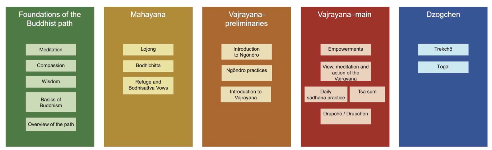

# favorites

I'm currently reading many books on zen and tibetan buddhism

I setup a calibre ebook server on linode and I'm sorting the 84,000 paths and the 80,000+ books on these subjects

## the path of insight

----

everything is changing, expect the unexpected, everything is atoms, atoms have no identity, atoms change patterns a according to laws which will end in entropy if no other prior causes or conditions keep them in order

----

some disciples don't understand why some gurus contradict theirselves

this happens because they're teaching people to stay on the path, some students swerve off to the left, some the right, naturally teachers have to point them to the middle

----

## the wisdom of tibetan buddhism

here's some of my favorites from this book.

----

### MEDITATE ON IMPERMANENCE, COMPASSION, AND EMPTINESS

Think about death and impermanence for a long time. Once you are certain that you are going to die, you will no longer find it hard to put aside harmful actions nor difficult to do what is right.

After that, meditate for a long time on love and compassion. Once love fills your heart, you will no longer find it hard to dispel all your delusions. Then meditate for a long time on emptiness, the natural state. Once you fully understand emptiness, you will no longer find it hard to dispel all your delusions.

—Geshe Potowa, quoted by Dzogchen Ponlop Rinpoche

----

### IF DISCIPLES DON’T PRACTICE

Great teachers appear, highly realized, amid the deluded people of this decadent age. . . . [They] are extremely knowledgeable; they have mastered all the sciences and bestowed teachings on fortunate disciples. However, if the disciples do not practice these teachings, they become superficially learned, which only increases their arrogance. They may develop some discipline, but it only increases their infatuation with their own virtue. They may reach a high position, but it only propagates greed, aggression, and laziness. These disciples have the same defects as ordinary people and so produce benefit neither for the dharma nor for sentient beings.

—Dilgo Khyentse Rinpoche

----

### NOTHING TO DO

There is actually nothing to do because the mind’s true nature already is perfect just as it is. If you are still fiddling about trying to manipulate your mind or experience in any way, then you have not got this . . . If there is no effort or contrivance in your meditation, if you are able to rest relaxed without clinging or fixation no matter what happens, then it is true mahamudra meditation.

—Khenpo Tsultrim Gyamtso Rinpoche

----

### HOW DO WE MEDITATE ON LOVING-KINDNESS?

One should begin by meditating on loving-kindness for one’s relatives, because it is easier to produce loving-kindness toward them. In the middle, one should meditate on loving-kindness for one’s enemies, because it is more difficult to generate it toward them. Finally, one should meditate on loving-kindness for all sentient beings.

—Ngorchen Konchog Lhundrup

----

### SIGNS THAT OUR PRACTICE IS NOT GOING RIGHT

The more you practice, the more you do retreats, the more experiences you have, the more rituals you learn, and the more skills you acquire, if your ego becomes bigger and bigger and bigger in the process, that is an indication that your practice is not going right. Additionally, if you look down on others who have no idea about such practices, that is a further indication that your practice is not going right.

—Dzogchen Ponlop Rinpoche

----

### WHAT ARE PHENOMENA EMPTY OF?

When we speak of a phenomenon as being empty, we are referring to its being empty of its own inherent existence. . . . Further, it is not that the object of the negation [inherent existence] formerly existed and is later eliminated, like the forest that existed yesterday and is burned by fire today, with the result that the area is now empty of the forest. Rather, this is an emptiness of an object of negation [inherent existence], which from beginningless time has never been known validly to exist.

—His Holiness the Fourteenth Dalai Lama

----

## AS IT IS VOL 2

The Treasury of Dharmadhatu by Longchenpa says:

The original nature, totally free of all thoughts, is the ultimate shamatha.

Natural cognizance, spontaneously present like the radiance of the sun,

Is the vipashyana that is utterly uncontrived and naturally present.

----

<iframe type="text/html" width="336" height="550" frameborder="0" allowfullscreen style="max-width:100%" src="https://read.amazon.com/kp/card?asin=B07RYHX16L&preview=inline&linkCode=kpe&ref_=cm_sw_r_kb_dp_0JTJJ26T9T93W3V9FQMX" ></iframe>
