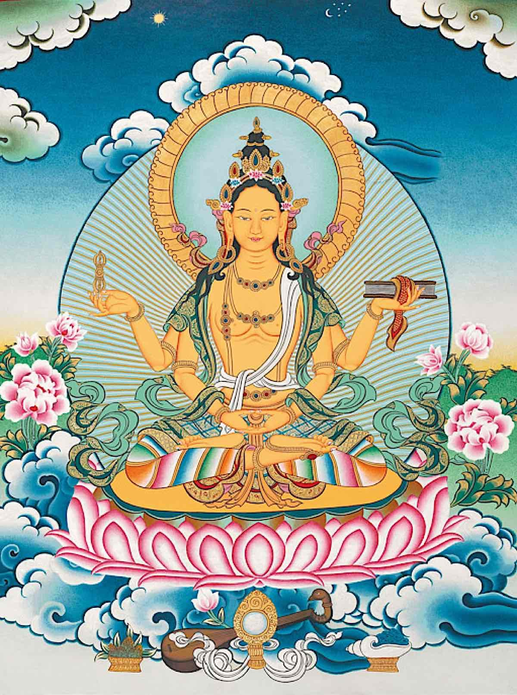

---
tags:
  - heart sutra 
  - books 
  - evening ritual 
  - ritual 
---
# The Heart Sutra

## heart sutra memorization command line app

<iframe width="859" height="531" src="https://www.youtube.com/embed/vllKiMq-q3M" title="memorization: python click app for memorizing the heart sutra (or anything)" frameborder="0" allow="accelerometer; autoplay; clipboard-write; encrypted-media; gyroscope; picture-in-picture; web-share" referrerpolicy="strict-origin-when-cross-origin" allowfullscreen></iframe>

---

## first letters line by line

- use the first letters to assist memorizing the lines of the heart sutra
- press show line to reveal

<button id="reveal">show line</button>

## first letters

- just the first letters of each word this is an efficient memorization technique
- print this out & cut it to carry a small scroll with you

!!! info "THE HEART OF PRAJNA PARAMITA SUTRA"

    ba
    wdiipp
    cptenotfs
    atas
    sfindfe
    eindff
    fie
    eif
    siiwfcvac
    sadaeic
    nanc
    ninp
    nind
    tie
    tinf
    tinfcvoc
    neentbom
    nfssttod
    nrovasf
    utnrom
    nioeoiasf
    utnaadoeoaad
    tinsncnenp
    tinwana
    tintbabwopp
    tbmiffh
    wnhtinf
    ffadadunir
    bwoppbotppaf
    aa
    tppitgpm
    tgem
    tsapm
    icras
    tittbad
    atppmist
    ggppbs

---

## study

[heart sutra study](https://www.ctworld.org.tw/Buddhist%20e-Books/Books05/index.html){ .md-button }

- SUTRA <-- mouse over for the definition
- this sutra study book has a chapter on the heart sutra + [some explanations](https://www.ctworld.org.tw/Buddhist%20e-Books/Books05/index.html)

!!! info "THE HEART OF PRAJNA PARAMITA SUTRA"

    Bodhisattva Avalokiteshvara, while deeply immersed in prajna paramita,
    clearly perceived the empty nature of the five skandhas, and transcended all suffering.
    Shariputra! Form is not different from emptiness, emptiness is not different from form.
    Form is emptiness, emptiness is form.
    So it is with feeling, conception, volition, and consciousness.

    Shariputra! All dharmas are empty in character; neither arising nor ceasing, neither impure nor pure, neither increasing nor decreasing.
    Therefore, in emptiness, there is no form;
    there is no feeling, conception, volition, or consciousness;
    no eye, ear, nose, tongue, body, or mind; no form, sound, smell, taste, touch, or dharmas;
    no realm of vision, and so forth, up to no realm of mind-consciousness;
    no ignorance or ending of ignorance, and so forth, up to no aging and death or ending of aging and death.

    There is no suffering, no cause, no extinction, no path.
    There is no wisdom and no attainment.
    There is nothing to be attained By way of prajna paramita, the bodhisattva's mind is free from hindrances.
    With no hindrances, there is no fear; freed from all distortion and delusion, ultimate nirvana is reached.

    By way of prajna paramita, buddhas of the past, present, and future attain anuttara-samyak-sambodhi.
    Therefore, prajna paramita is the great powerful mantra, the great enlightening mantra, the supreme and peerless mantra.
    It can remove all suffering.  This is the truth beyond all doubt.

    And the prajna paramita mantra is spoken thus:
    gate gate paragate parasamgate bodhi svaha.

## explanation

<iframe width="560" height="315" src="https://www.youtube.com/embed/videoseries?si=alfuyO8EQSECzJHI&amp;list=PLqhBSEbitutu1nltHWUPyLzgRJx0VLRbL" title="YouTube video player" frameborder="0" allow="accelerometer; autoplay; clipboard-write; encrypted-media; gyroscope; picture-in-picture; web-share" referrerpolicy="strict-origin-when-cross-origin" allowfullscreen></iframe>

<iframe width="918" height="694" src="https://www.youtube.com/embed/ej0_39J4yts" title="The Heart Sutra of Mahayana Buddhism as Explained by The Fourteenth Dalai Lama of Tibet" frameborder="0" allow="accelerometer; autoplay; clipboard-write; encrypted-media; gyroscope; picture-in-picture; web-share" referrerpolicy="strict-origin-when-cross-origin" allowfullscreen></iframe>

<iframe width="1109" height="625" src="https://www.youtube.com/embed/_p1_RZpCQos" title="𝐓𝐡𝐞 𝐇𝐞𝐚𝐫𝐭 𝐒𝐮𝐭𝐫𝐚 ~  Prajñāpāramitā  ~ The Perfection of Wisdom" frameborder="0" allow="accelerometer; autoplay; clipboard-write; encrypted-media; gyroscope; picture-in-picture; web-share" referrerpolicy="strict-origin-when-cross-origin" allowfullscreen></iframe>

## wip: chart

## about

- some say the heart sutra is a summary of the [diamond sutra](diamond_sutra.md)
- diamond sutra is a summary of x scrolls

---

The short title of this most popular and important sutra.

It contains the very essence of the vast body of the Prajna Paramita Sutras in Buddhism.

---

> prajna (Skt.)
>> Great transcendental wisdom; wisdom of understanding the empty nature of the "self" and all phenomena, which can overcome birth-and-death and all suffering, as well as enlighten all beings.

---

> paramita (Skt.)
>> Literally, "to the other shore." The six paramitas (perfections) are practiced by bodhisattvas to attain buddhahood: perfection of charity (dana), moral conduct (shila), tolerance (kshanti), diligence (virya), meditation (dhyana), and most import- ant of all, wisdom (prajna), which brings true liberation.
