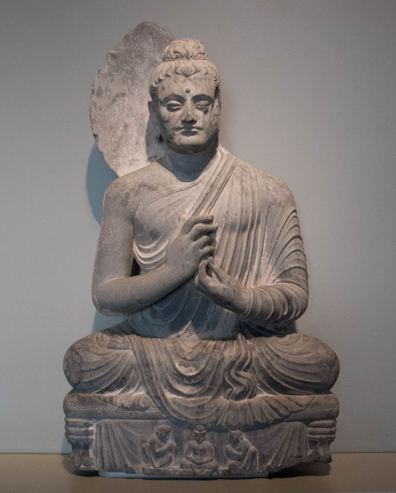

---
tags:
  - level 1 
  - level 2 
---

## buddhism study journals

- [morning & evening ritual](evening_ritual.md){ .md-button }

- I studied buddhism at home for a few years during covid
- started a chan meditation class in 2023
- [x] 2023-24 20 week Chan meditation course [level 1](level_1.md)
- [x] 2024-25 20 week Chan meditation course [level 2](level_2.md)
- [ ] 2025 level 3 40 week course [level 3](level_3.md)
- [ ] 2027-31 sutra study 80 week course

## command line apps for memorizing sutras

<iframe width="859" height="531" src="https://www.youtube.com/embed/vllKiMq-q3M" title="memorization: python click app for memorizing the heart sutra (or anything)" frameborder="0" allow="accelerometer; autoplay; clipboard-write; encrypted-media; gyroscope; picture-in-picture; web-share" referrerpolicy="strict-origin-when-cross-origin" allowfullscreen></iframe>

## research notes on buddhism

[diamond sutra: the mind seal of prajna wisdom audiobook](https://www.ctworld.org.tw/Buddhist%20e-Books/Audio/Book007/index.html){ .md-button }
[heart sutra study](https://www.ctworld.org.tw/Buddhist%20e-Books/Books05/index.html){ .md-button }
[seven round compassion contemplation](seven_full.md){ .md-button }
[books](books.md){ .md-button }

- screencast about this site

<iframe width="1120" height="700" src="https://www.youtube.com/embed/J3dLt9TaAnw" title="buddhism homepage" frameborder="0" allow="accelerometer; autoplay; clipboard-write; encrypted-media; gyroscope; picture-in-picture; web-share" allowfullscreen></iframe>

[TAGS]
