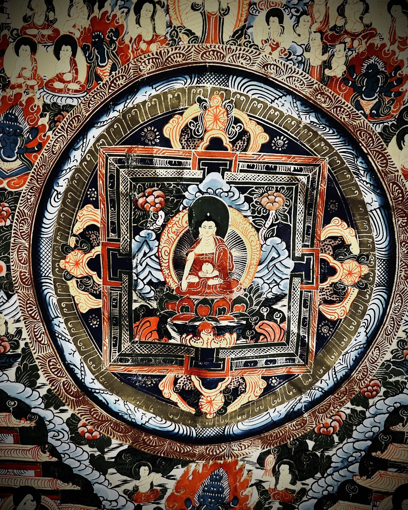

[home](https://shane0.github.io){ .md-button }
[workflow template](https://shane0.github.io/workflow/){ .md-button }

[cheatsheets](https://shane0.github.io/cheatsheets/){ .md-button }
[retro games](https://shane0.github.io/adventure/){ .md-button }

!!! quote

    everything                             | nothing
    ---------------------------------------|------------------------------------
    everything is interdependent           | nothing is independent
    everything is changing and impermanent | nothing is unchanging and permanent

!!! warning "the laws of physics"

    - everything is made of atoms
    - atoms form elements 
    - all elements will eventually become equally mixed together
    - eventually there will be no more pure elements left

## buddhism research

- these are my online notes for buddhism and similar traditions
- buddhism overlaps science but the main topic is buddhism
- currently I am taking a mahayana [20 week linji chan buddhism class](lesson_1.md)
- also reading books in the chan & zen traditions so there are notes on those
- previously I kept notes on therevada, vajrayana and dzogchen which I will migrate here
- note: I use natural language processors so some of this content is robotic
- like this example with [carbon and origination](origination.md)

## a scientific take on buddhism

- [dependent origination and carbon](origination.md)

PHYSICS: the world is made up of tiny things called atoms, atoms follow rules with no known exceptions, atoms form different shapes and these shapes are not permanent

BUDDHISM: suffering comes from clinging to things and wishing they last forever

- to end suffering, accept and understand things are atoms and atoms change form without exception
- the practice is about how to let go of ignorance and see the world clearly as it is

[TAGS]
