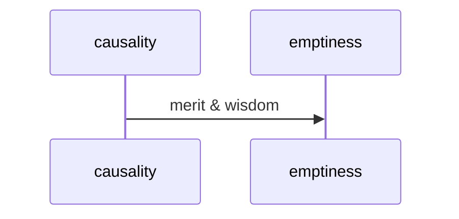
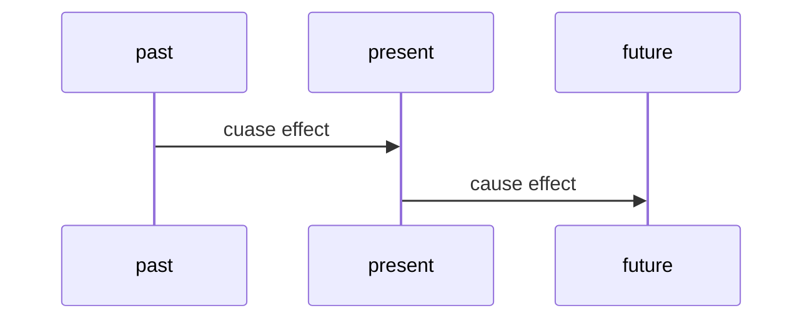
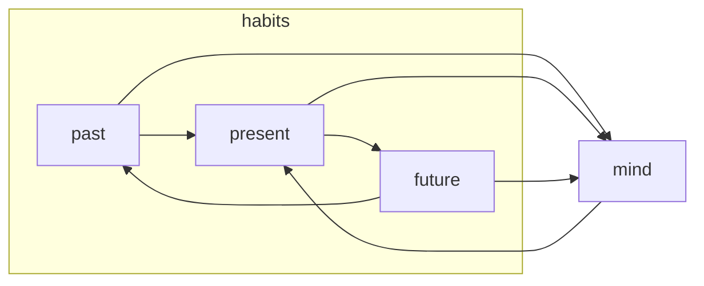
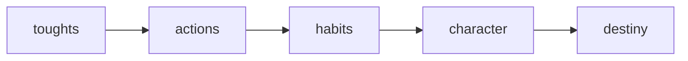

---
tags:
  - karma
  - week 3 
  - level 1 
---
# karma

## mermaid charts[^1]

- middle way

- karma

- samsara
- breaking habits
- moment to moment
- day to day
- life after life

## changing destiny

Liao-Fan's Four Lessons is a book written by Yuan Liaofan, a Confucian scholar and government official in the Ming Dynasty China. It is a guide to changing one's destiny through moral cultivation and good deeds.

The four lessons are:

1. **Learning to Create Destiny:** This lesson teaches that our destiny is not fixed, but can be changed through our thoughts, words, and actions.
2. **The Ways to Reform:** This lesson teaches how to identify and correct one's faults.
3. **The Ways to Cultivate Goodness:** This lesson teaches how to cultivate good deeds and virtues.
4. **Benefits of the Virtue of Humility:** This lesson teaches the importance of humility and its benefits.

Liao-Fan wrote the book for his son, Yuan Tianqi, who had been predicted by a fortune teller to have a short and unsuccessful life. Liao-Fan was determined to change his son's destiny, so he followed the teachings of the book and practiced them diligently. As a result, his son's life changed dramatically. He passed the imperial civil service exam with the highest score and went on to have a long and successful career.

Liao-Fan's Four Lessons is a timeless classic that has been translated into many languages and read by millions of people around the world. It is a practical guide to changing one's destiny and living a better life.

Here are some of the key takeaways from Liao-Fan's Four Lessons:

- Our destiny is not fixed, but can be changed through our thoughts, words, and actions.
- We should identify and correct our faults.
- We should cultivate good deeds and virtues.
- Humility is an essential virtue.

Liao-Fan's Four Lessons is a valuable resource for anyone who wants to improve their life and achieve their goals. It is a reminder that we have the power to create our own destiny.

[^1]: <https://mermaid.js.org/>
