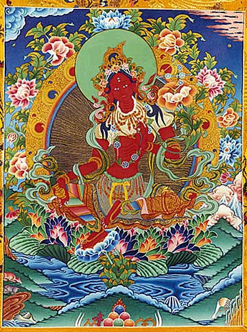
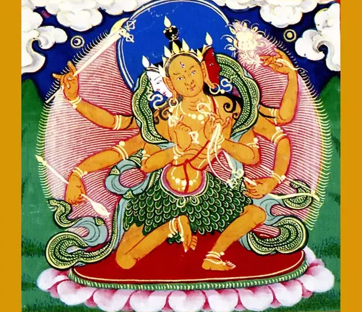

# Paranasabari

[Paranasabari](https://en.wikipedia.org/wiki/Paranasabari)

<iframe width="560" height="315" src="https://www.youtube.com/embed/9_FWD0gjE-0" frameborder="0" allow="accelerometer; autoplay; encrypted-media; gyroscope; picture-in-picture" allowfullscreen></iframe>

## text

The Meaning and Benefits of the Mantra of Loma Gyonma (Parnashavari) It is stated in the Collected Teachings (Kabum) of Lord Jigten Sumgön that the mantra of Parnashavari is very effective and powerful for healing, pacifying, and bringing the pestilences under control.

Mantra: OM PI-SHA-TSI PARNA-SHA-WARI SARVA

MA-RI PRA-SHA-MA-NI HUNG

OM: sacred syllable that consists of three sounds A, O and M, representing Buddha’s purified body, speech and mind, which bless and activate our body speech and mind, plant the seed of the three kayas (nirmanakaya, sambhogakaya and dharmakaya).  Here in particular, the sounds are invoked to prevent, protect and liberate our body, speech and mind from the epidemic disease such as the coronavirus.

PISHATSI: a female divinity of great powers such as a dakini or yogini who can protect, prevent and liberate beings from all demonic spirits, negative and obstructing forces

PARNA: a leaf of a tree or a plant

SHAWARI: a tribal lady of the forest who masters magic and healing using forest herbs and medicines.

PISHATSI PARNASHAWARI: a powerful dakini who attired in green leaves of medical plants that are remedies to all illnesses and pestilences

SARVA: all, everything

MARI: illness or pestilence

PRASHAMANI: pacifier

SARVA MARI PRASHAMANI: the Pacifier of all illnesses and pestilences

HUNG: to attain the siddhis (attainment), to fulfill the aspiration, to be established in the deity- state, the Parnashavari-hood.

Praise to the Goddess

Who Eliminates All Diseases (Parnashavari) Out of the mandala of dharmakaya’s great bliss You protect against dangerous diseases like epidemics

And against untimely death– I pay homage to you, the mother of wish-fulfilling activities.
法界大樂壇城中,守護疫情病難及,驅除非時死畏懼,成事佛母前頂禮!

You, golden-colored Parnashavari, sit on a lotus seat, Your main face is yellow, the right one blue, and the left one white Your hair is bound up in a topknot, and you are full of splendor– I pay homage to the divine body of the goddess granting accomplishments.
金色葉衣蓮花墊,中面黃右藍左白,頭髻往上威武尊,事業佛母前頂禮!

You, Illustrious One, are the embodiment of wisdom and compassion, You stand in the midst of masses of fire, burning like at the end of time, With your three faces and six arms, you look terribly wrathful–
I pay homage to you, whose one leg is stretched and the other bend.

智悲總體如來尊,立於劫末熊火中,三面六臂忿怒尊,伸曲二足前頂禮!

You, who wears a robe of leaves, hold bow and arrow, Battle ax, and a bunch of branches.

Parnashavari, you show the threatening mudra and hold a vajra– I pay homage to you, great mother, protectress of beings.

身以葉衣之莊嚴,手持箭斧和葉子,金剛杵威懾獵手,怙主佛母前頂禮!

OM PI SHA TSI PARNA SHA WA RI SARVA MA RI PRA SHA MA NI HUNG

嗡必夏字巴爾那夏瓦日薩爾瓦瑪日巴惹夏瑪尼吽

By this virtue,

may I swiftly accomplish Parnashavari and establish all beings without exception in her state.

以我所修此功德,成就葉衣佛母尊,一切眾生盡無餘,願皆度至彼淨土。

This was taken from the collected works of Drikung Kyobpa Jigten Sumgön.

此法摘自直貢覺巴吉天頌恭之法藏。
