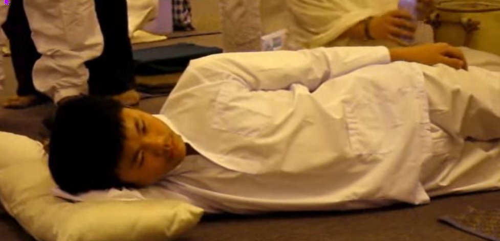

# dream yoga 

These are mostly notes from the book As It Is Vol 1 which has more information on this subject, and there are many others on the subject which I have but have not read so this page will get updated as I learn more[^5]

### outline 

1. sleep on your right side sleeping lion posture [^1][^2]
2. visualize a 4 petal red lotus flower in your heart center.
3. visualize the AH syllable in the center of the flower radiating white light
4. rest your mind naturally in rigpa as you fall asleep and visualize this, your mind is unfixed and leaving the experience as it is

### details 

as it is vol 1  chapter 9 page 157 [^5]

(from a conversation with a student asking about this)

Here is one method of how to begin. 

Visualize a four-petaled red lotus flower in your heart center. 

Imagine that your mind is in the form of the syllable AH in the center of this lotus flower. 

The syllable AH is brilliant and radiates light. 

While visualizing this, at the same time also recognize what visualizes. 

Recognize that which your own guru pointed out as being the state of rigpa, and simply leave it as it is, naturally, while allowing the visualization to continue. 

In that state, gendy fall asleep. 

This is not something that happens overnight; we need to train in this every evening when falling asleep. 

Maintain the visualization while falling asleep, and while in the state of the naturalness of rigpa as well. 

In this context, the light of the letter AH is called manifest luminosity, and the rigpa that is recognized is called the empty luminosity. 

In this way, appearance and emptiness are a unity. 

That is the luminosity ofrigpa. 

The light is brilliant, radiant white, just like when you switch on the electric light. 

The traditional image for this is a butter lamp inside a vase, because there was no electricity in Tibet. 

That is the image for manifest luminosity. 

The white light is manifest luminosity, whereas the empty luminosity is the primordial purity of empty mind essence. 

Recognize that. 

The object that is being held in mind to a certain 157  extent is the radiant white syllable AH, while the awareness of it remains without any ftxation. 

Simply fall asleep in that state. 

The posture used in going to sleep is called 'the posture of a sleeping lion.' 

It's important to lie on the right side, because the channels through which disturbing emotions move are mainly on the right side. 

To suppress that flow of disturbing emotions, one lies on the right side. 

When pressing the channel through which the current of disturbing emotion flows, there will be less conceptual thought. 

It's like when you exhale the stale breath: don't you start by exhaling through the right nostril? The physical body is said to be a city, the city of the illusory body. 

This body is a big city. 

There are so many channels, so many winds moving through them - thousands and thousands of channels, and twenty-one thousand six hundred movements of pranas or winds during a single day and night. 

There are eighty-four thousand different types of mental states or disturbing emotions. 

This enormous scale of movement is like that of a big city, isn't it? How many microbes are there within this one body? It is impossible to count. 

Each of these is sentient, so it really is like a big city. 

The illusory city of the physical body is like Kathmandu! When mainly practicing the recognition of mind essence, the currents called the karmic wind, which means conceptual thinking, are naturally transformed into the wisdom wind. 

Impure channels are naturally transformed into the wisdom channel, and dualistic mind is naturally transformed into original wakefulness. 

Usually this is described as the winds dissolving into the central channel. 

The immense traffic of wind through the different channels all dissolves into the central channel.

### drugs, dreaming & delusion

The Buddha sees that all sentient beings are dreaming: they are dreaming the six realms, they are dreaming the four places of rebirth, they are dreaming all their joys and sorrows. 

When we are on the bodhisattva bhumis, we are just about to wake up from the dream. 

Only the fully enlightened Buddha is totally awakened. 

Buddhas see that beings are ignorant. 

Sleep is only a subsidiary of ignorance; the real stupidity is not knowing our own awareness wisdom. 

Buddhist training is all about first recognizing this basic nature, then training in the strength of recognition, and finally attaining complete stability. 

That is the only way to awaken from this dream state. 

We need to obliterate this deluded thinking, and no material thing in this world can do that. 

The only way is to recognize the insubstantial identity of the thinker and experience the three kayas indivisibly. 

There is no other way. 

No drug, not even the strongest anesthesia, will totally eliminate deluded thinking; it only puts it on pause, bringing it to a temporary halt. 

The moment the anesthetic wears off, thinking begins again. 

Drugs also block the enlightened qualities of original wakefulness, the wisdom qualities. 

Under their influence, there is no wisdom of seeing the nature as it is, and no quality of seeing all that exists. 

Rather, we are totally obscured by mindlessness. 

To make oneself mindless and oblivious is not a solution. 

An anaesthetic that lasted forever would certainly wipe out all conditioned states of pleasure, pain and indifference, but there is no such drug. 

EVERY DRUG HAS ONLY A TEMPORARY EFFECT, WHICH SOON WEARS OFF.   

## purification

personally I like to listen to the vajrasatva 100 syllable mantra while going to sleep, you can right click the video if you are on a computer to loop the video so it plays all night[^4]

there is a multi step purification meditation in the book Turning confusion to clarity that I'll write more about later on this subject[^6]

<iframe width="1012" height="759" src="https://www.youtube.com/embed/_W1VFOlkoZo" frameborder="0" allow="accelerometer; autoplay; clipboard-write; encrypted-media; gyroscope; picture-in-picture" allowfullscreen></iframe>

----

[^1]:[ergonomic positions](https://youtu.be/or03pT-D8cQ)
[^2]:[sleeping lion posture](https://youtu.be/g2eEPdUQCtc)
[^3]:[seed syllables](https://www.rigpawiki.org/index.php?title=Main_Seed_Syllables)
[^4]:[100 syllable mantra](https://youtu.be/_W1VFOlkoZo)
[^5]:<http://www.rangjung.com/book_title/as-it-is-volume-i-2/>
[^6]:<https://www.shambhala.com/turning-confusion-into-clarity-3118.html>
