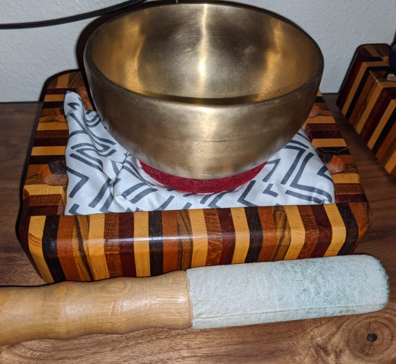

# originals

[intro to meditation page](../noobs.md)

in loch kelly's book effortless mindfulness he suggests creating your own guided meditations

i plan to do this soon and i'll post them here

i'm not sure they'll make much sense for anyone else since they are going to be tailored to me but i'd like to keep a journal on them either way
 
## meditative videos

### 2020-06-26

i got [bitwig](https://www.bitwig.com/en/home.html) software for fathers day so i'm exploring it's features, it's excellent for making meditation sounds

<iframe width="730" height="579" src="https://www.youtube.com/embed/H2fduGv7jwo" frameborder="0" allow="accelerometer; autoplay; encrypted-media; gyroscope; picture-in-picture" allowfullscreen></iframe>

---

started making audio and video recordings for meditation, plan to make some of my own guided meditations coming soon

> soundscape

this ones creepy, good for distracting the monkey mind, [impermanence](../impermanence.md) or emptiness such as the [heart sutra](../heart-sutra.md)

<iframe width="560" height="315" src="https://www.youtube.com/embed/sR0NGY1hjzY" frameborder="0" allow="accelerometer; autoplay; encrypted-media; gyroscope; picture-in-picture" allowfullscreen></iframe>

> tibetan bowl audio

good way to start or end a meditation

<iframe width="560" height="315" src="https://www.youtube.com/embed/VRiSzHLHHpg" frameborder="0" allow="accelerometer; autoplay; encrypted-media; gyroscope; picture-in-picture" allowfullscreen></iframe>
[download in hi res](bowl.wav) audio recorded with a Marantz pmd661

[more meditative music](https://shanenull.com/music/genres/meditation/)
