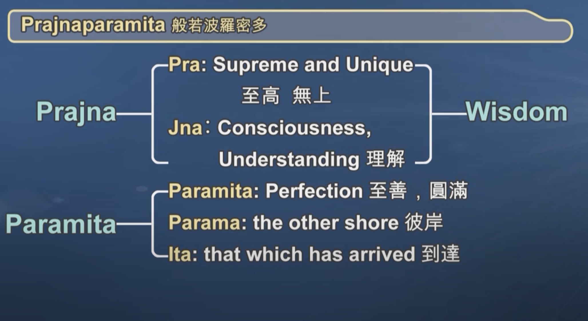

---
tags:
  - index 
  - heart sutra 
  - diamond sutra 
  - mahaprajnaparamita
---
# Prajñāpāramitā

## mahaprajnaparamita

- <https://www.abebooks.com/servlet/BookDetailsPL?bi=31934163893>

The Prajñāpāramitā literature is extensive and includes various sutras of different lengths, emphasizing the perfection of wisdom and the concept of emptiness. While there isn't a single sutra that comprehensively covers all aspects of Prajñāpāramitā teachings, there are several key texts within the genre. Some of the most notable ones include:

Aṣṭasāhasrikā Prajñāpāramitā Sūtra (The Perfection of Wisdom in 8,000 Lines):

This sutra is one of the longer Prajñāpāramitā texts and provides extensive teachings on emptiness and the Bodhisattva path.
Pañcaviṃśatisāhasrikā Prajñāpāramitā Sūtra (The Perfection of Wisdom in 25,000 Lines):

As the name suggests, this is an even longer version of the Prajñāpāramitā Sutra, offering more detailed teachings.
Daśabhūmika Sūtra (Sutra on the Ten Grounds):

This sutra describes the ten Bodhisattva grounds or stages of realization, each associated with specific qualities and virtues.
Mañjuśrīparipṛcchā Sūtra (The Questions of Mañjuśrī):

This sutra features a dialogue between the Bodhisattva Mañjuśrī and the Buddha, discussing profound topics related to emptiness and wisdom.
Ratnaguṇasaṃcayagāthā (The Jewel Heap Sutra):

This text is a collection of verses that emphasize the qualities of the Bodhisattva and the nature of emptiness.
Vajracchedikā Prajñāpāramitā Sūtra (The Diamond Sutra):

While the Diamond Sutra is not as lengthy as some of the others, it is highly revered for its concise teachings on emptiness and skillful means.
Prajñāpāramitā Ratnaguṇasaṃcayagāthā (The Jewel Accumulation of the Perfection of Wisdom):

This is another text that emphasizes the qualities of the Bodhisattva and the merits of practicing the perfection of wisdom.
These texts collectively contribute to the Prajñāpāramitā literature, each offering insights from different perspectives and elaborating on the profound nature of emptiness. Practitioners often study various Prajñāpāramitā texts to gain a comprehensive understanding of the wisdom teachings in Mahayana Buddhism.
