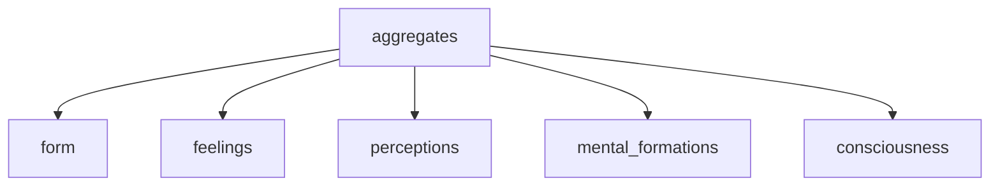

---
tags:
  - primordial confusion 
  - aggregates 
  - no self 
  - deduction 
  - heart sutra
---
# aggregates

!!! info

    - <https://www.dhammatalks.org/suttas/SN/SN22_48.html>
    - <https://www.dhammatalks.org/suttas/MN/MN44.html>

<iframe width="923" height="577" src="https://www.youtube.com/embed/TuOgsn60oYw" title="0205n1b2 The Five Aggregates \ \ Thanissaro Bhikkhu \ \ Dhamma Talks" frameborder="0" allow="accelerometer; autoplay; clipboard-write; encrypted-media; gyroscope; picture-in-picture; web-share" allowfullscreen></iframe>

<iframe width="802" height="501" src="https://www.youtube.com/embed/dx4j8eA_aDc" title="220321 Understanding Aggregates \ \ Thanissaro Bhikkhu \ \ Dhamma Talk" frameborder="0" allow="accelerometer; autoplay; clipboard-write; encrypted-media; gyroscope; picture-in-picture; web-share" allowfullscreen></iframe>

<iframe width="560" height="315" src="https://www.youtube.com/embed/alZaa06ZFJw?si=MvABZ8UaQFGgFHE9&amp;clip=UgkxhHjpEH_ipTyPwL74u-C_lYItHZu7GgCl&amp;clipt=EMWUVxik6Vo" title="YouTube video player" frameborder="0" allow="accelerometer; autoplay; clipboard-write; encrypted-media; gyroscope; picture-in-picture; web-share" allowfullscreen></iframe>

- form: physical, body, atoms
- perceptions:  extended definition of perception , perceptual apparatus up to recognition of what is perceived including naming of it
- feelings: immediate reaction to sense perception - neutral, attraction or aversion
- mental formations:
- consciousness:

## what is khanda sutta

The Khandha Sutta is a discourse from the Pali Canon of Theravada Buddhism. The word "khandha" in Pali refers to the five aggregates of physical and mental phenomena that make up the concept of an individual self.

The five aggregates are:

- form (body)
- feelings
- perceptions
- mental formations
- consciousness

In the Khandha Sutta, the Buddha teaches about the nature of the five aggregates and their interdependence. He explains that these aggregates are not a permanent, unchanging self, but are instead impermanent and constantly changing phenomena that arise and pass away in response to different conditions.

The Khandha Sutta is often used as a teaching tool to help practitioners understand the nature of self and reality. By examining the five aggregates, practitioners can gain insight into the impermanence and lack of self in all things and develop a more profound understanding of dependent origination, the idea that all phenomena arise in dependence upon other phenomena.

Through this insight, practitioners can overcome attachment and ignorance, and eventually attain liberation from the cycle of birth and death. The Khandha Sutta is an important text in Theravada Buddhism and is widely studied by practitioners seeking to deepen their understanding of Buddhist teachings.

## Alagaddupama Sutta

The Alagaddupama Sutta discusses the five aggregates of experience: form, sensation, perception, mental formations, and consciousness. It explains how these aggregates are the source of suffering and how to liberate oneself from them.

The Buddha teaches that the aggregates are not permanent or solid. They are constantly changing and impermanent. He also teaches that the aggregates are not self. They are not something that you are. They are simply experiences that you have.

The Buddha teaches that when you cling to the aggregates, you suffer. When you try to control them or make them permanent, you suffer. When you identify with them, you suffer.

The Buddha teaches that the way to liberate yourself from suffering is to let go of the aggregates. Let go of your attachment to them. Let go of your need to control them. Let go of your need to make them permanent. Let go of your need to identify with them.

When you let go of the aggregates, you are free from suffering. You are free to experience the world without attachment. You are free to experience the world without suffering.

## The Five Aggregates

The Five Aggregates (Pali: *khandha*, Sanskrit: *skandha*) are a key concept in Buddhist philosophy that describe the basic components of human experience. They are:

1. Form (Rupa)
2. Feeling (Vedana)
3. Perception (Sanna)
4. Mental Formations (Sankhara)
5. Consciousness (Vinnana)

### Form (Rupa)

| Aspect          | Definition                                                                                      |
|-----------------|-------------------------------------------------------------------------------------------------|
| 1. Visible form | The physical body and all external objects that are perceived through the eyes or other senses. |
| 2. Sound        | All auditory experiences, including speech, music, and environmental sounds.                    |
| 3. Smell        | All olfactory experiences, including scents and odors.                                          |
| 4. Taste        | All gustatory experiences, including flavors and textures.                                      |
| 5. Touch        | All tactile experiences, including sensations of pressure, heat, cold, and texture.             |

### Feeling (Vedana)

| Aspect        | Definition                                                 |
|---------------|------------------------------------------------------------|
| 1. Pleasant   | The experience of pleasure, enjoyment, or satisfaction.    |
| 2. Unpleasant | The experience of pain, discomfort, or dissatisfaction.    |
| 3. Neutral    | The absence of any strong emotional or sensory experience. |

### Perception (Sanna)

| Aspect                          | Definition                                                                                                     |
|---------------------------------|----------------------------------------------------------------------------------------------------------------|
| 1. Perception of forms          | The ability to recognize and distinguish visual objects and shapes.                                            |
| 2. Perception of sounds         | The ability to recognize and distinguish auditory stimuli.                                                     |
| 3. Perception of smells         | The ability to recognize and distinguish olfactory stimuli.                                                    |
| 4. Perception of tastes         | The ability to recognize and distinguish gustatory stimuli.                                                    |
| 5. Perception of touches        | The ability to recognize and distinguish tactile stimuli.                                                      |
| 6. Perception of mental objects | The ability to recognize and distinguish mental states and phenomena, such as emotions, thoughts, and beliefs. |

### Mental Formations (Sankhara)

| Aspect        | Definition                                                                               |
|---------------|------------------------------------------------------------------------------------------|
| 1. Volition   | The intention or will to act or think in a certain way.                                  |
| 2. Attention  | The ability to focus and direct one's awareness towards specific objects or experiences. |
| 3. Perception | The mental process of recognizing and interpreting sensory stimuli.                      |
| 4. Thought    | The process of forming and manipulating mental concepts and ideas.                       |
| 5. Emotion    | The experience of affective states such as joy, anger, fear, or desire.                  |
| 6. Memory     | The ability to retain and recall past experiences and information.                       |
| 7. Craving    | The mental state of attachment or desire for particular objects, experiences, or states. |
| 8. Ignorance  | The mental state of not understanding or recognizing the true nature of phenomena.       |

### Consciousness (Vinnana)

| Aspect                  | Definition                                                           |
|-------------------------|----------------------------------------------------------------------|
| 1. Eye-consciousness    | The awareness or perception of visual objects through the eyes.      |
| 2. Ear-consciousness    | The awareness or perception of auditory stimuli through the ears.    |
| 3. Nose-consciousness   | The awareness or perception of olfactory stimuli through the nose.   |
| 4. Tongue-consciousness | The awareness or perception of gustatory stimuli through the tongue. |
| 5. Body-consciousness   | The awareness or perception of tactile sensations through the body.  |
| 6. Mind-consciousness   | The awareness or perception of mental states and phenomena.          |

---
tags:

- impermanence

---

# Upajjhatthana

The Five Remembrances, also known as Panca Niyama Dhamma in Pali, are a set of reflections in Buddhism that help cultivate MINDFULNESS and appreciate the preciousness of life. They are:

1. I am of the nature to grow old. There is no way to escape aging and death.
1. I am of the nature to have ill health. No one is immune to sickness, injury, and disease.
1. I am of the nature to die. Death is an inevitable reality for all living things.
1. All that is dear to me and everyone I love are of the nature to change. Nothing lasts forever, including relationships and possessions.
1. My actions (karma) are the only belongings I bring with me beyond this life. My thoughts, words, and deeds will determine the quality of my future experiences.

## benefits

- Overcoming attachment: By realizing the transient nature of all things, one can overcome attachment to material possessions and emotions, leading to a more peaceful and contented life.
- Reducing fear of death: By understanding that all things are impermanent and subject to change, one can reduce fear of death and the unknown.
- Promoting wisdom: An appreciation of the impermanence of all things can deepen one's understanding of the nature of reality, leading to greater wisdom.
- Improving mindfulness: Meditation on impermanence encourages MINDFULNESS of the present moment and helps one stay focused on what is happening in the present, rather than dwelling on the past or worrying about the future.
- Encouraging self-reflection: By contemplating impermanence, one can reflect on the purpose and meaning of life, and focus on what is truly important.

## Upajjhatthana

Here are the general steps to meditate with the Five Recollections (Upajjhatthana) in Theravada Buddhism:

Find a quiet place to sit comfortably and establish a stable posture.

Begin with a few deep breaths, calming your mind and body.

Recite the Five Recollections mentally or out loud, if desired:

I am of the nature to grow old. Age is inevitable.
I am of the nature to have ill health. Illness is inevitable.
I am of the nature to die. Death is inevitable.
All that is dear to me and everyone I love are of the nature to change. Separation from them is inevitable.
My actions are my only true belongings. I cannot escape the consequences of my actions. My actions are the ground upon which I stand.
Reflect deeply on each recollection, allowing the message to penetrate your mind.

Spend time contemplating the truths contained within each recollection.

End the meditation with a few deep breaths and a sense of gratitude for the opportunity to reflect on these important truths.

Repeat the meditation as often as you like, especially when feeling uncertain or discouraged.

Remember that meditation is a personal journey and there is no right or wrong way to do it. The goal is to deepen your understanding of the Five Recollections and the impact they have on your life. With consistent practice, you will develop a stronger MINDFULNESS and sense of inner peace.

## Upajjhatthana or the "Five Recollections"

is a meditation practice found in Theravada Buddhism. It involves contemplating the following five topics:

- The recollection of impermanence: The meditation focuses on the impermanence of all things and the transience of life.
- The recollection of death: The meditation reflects on the inevitability of death and the unpredictability of when it will occur.
- The recollection of the purity of the Buddha, Dharma, and Sangha: The meditation focuses on the qualities of the Three Jewels of Buddhism – the Buddha, the Dharma, and the Sangha – and their role in helping one reach enlightenment.
- The recollection of the virtues of one's own moral conduct: The meditation reflects on one's own actions and the impact they have on one's own life and the lives of others.
- The recollection of generosity: The meditation focuses on the benefits of generosity and the importance of practicing it in order to develop a generous mind.

The goal of the Upajjhatthana meditation is to bring about a sense of urgency in one's spiritual practice and to develop a strong motivation for the attainment of enlightenment.

By contemplating the impermanence of life and death, the purity of the Three Jewels, one's own conduct, and the benefits of generosity, practitioners are encouraged to cultivate a deeper understanding of the Dharma and to live their lives in accordance with Buddhist teachings.

## what is Upajjhaṭṭhana

Upajjhaṭṭhana is a Pali word that means "the four reminders."

In Theravada Buddhism, Upajjhaṭṭhana is a practice of self-reflection and MINDFULNESS that is used to cultivate a sense of awareness and understanding.

It is one of the Five Spiritual Faculties, along with faith, effort, mindfulness, and concentration.

The four reminders of Upajjhaṭṭhana are:

- Impermanence (Anicca): Everything is constantly changing and nothing lasts forever.
- Suffering (Dukkha): All existence is characterized by suffering and unsatisfactoriness.
- Non-self (Anatta): The self is not a permanent, unchanging entity but is instead a collection of ever-changing mental and physical phenomena.
- The Four Noble Truths: The teachings of the Buddha about the nature of suffering and the path to liberation from it.

By contemplating these four reminders, practitioners of Upajjhaṭṭhana aim to gain a deeper understanding of the nature of reality and the causes of suffering, and to develop greater wisdom, compassion, and liberation from negative mental states and suffering.

The practice can be performed alone or as part of a group, and can be a helpful tool for gaining greater insight and clarity in one's daily life.
