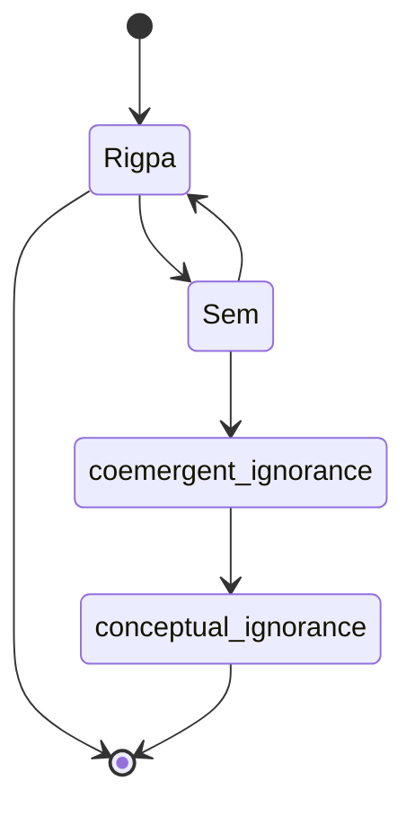

# dzoghchen state chart

```mermaid
stateDiagram-v2
    [*] --> Rigpa
    Rigpa --> [*]
    Rigpa --> Sem
    Sem --> Rigpa
    Sem --> coemergent_ignorance
    coemergent_ignorance --> conceptual_ignorance
    conceptual_ignorance --> [*]
            
```
