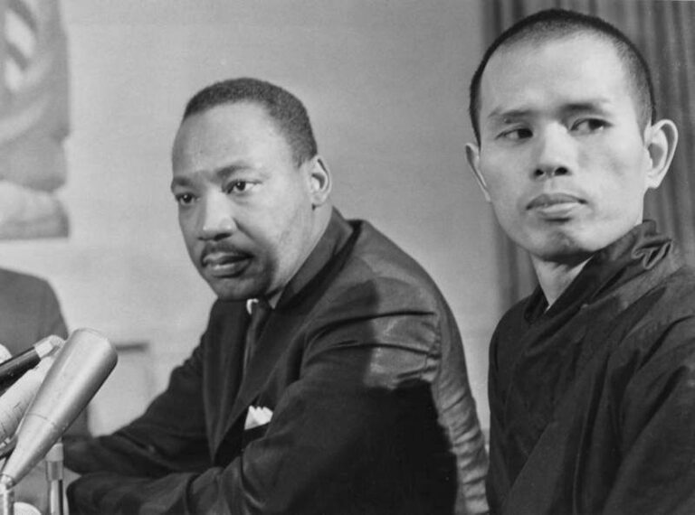

---
tags:
  - soto 
  - therevada 
  - walk 
  - sit 
  - eat 
---
# thich

- thich nhat hahn aka thay & plum village
- previously read many of his books
- I am migrating some notes from that here so this page is random

<iframe width="736" height="577" src="https://www.youtube.com/embed/VMceJtKxuNg" title="Part time Buddha" frameborder="0" allow="accelerometer; autoplay; clipboard-write; encrypted-media; gyroscope; picture-in-picture; web-share" allowfullscreen></iframe>

Mindful Essentials - How to Live

[How to Live](https://plumvillage.org/books/how-to-live/)

## How to Eat

---

I often teach orange meditation to my students. We spend time sitting together, each enjoying an orange. Placing the orange on the palm of our hand, we look at it while breathing in and and out, so that the orange becomes a reality. If we are not here, totally present, the orange isn’t here either.

---

There are some people who eat an orange but don’t really eat it. They eat their sorrow, fear, anger, past, and future. They are not really present, with body and mind united. When you practice mindful breathing, you become truly present.

---

## How to Love

---

THE FOUR ELEMENTS OF TRUE LOVE

---

True love is made of four elements: loving kindness, compassion, joy, and equanimity. In Sanskrit, these are, maitri, karuna, mudita, and upeksha. If your love contains these elements, it will be healing and transforming, and it will have the element of holiness in it. True love has the power to heal and transform any situation and bring deep meaning to our lives.

---

> This is unconditional love, it’s timeless, it’s not sensual it's timeless love and non-conceptual, often what people call love is something else, a transaction where people love someone for what they do for your ego with fleeting circumstances like beauty, money or favors. --> me paraphrasing from his other lectures

---

## How to See

---

LOOKING WITH THE EYES OF COMPASSION

---

Learning to look at others with the eyes of compassion is a wonderful practice. You don’t suffer anymore, and your way of looking at others makes them feel better. Each day you can celebrate your twenty-four brand new hours and make the vow to look at all beings with the eyes of compassion.
Waking up this morning, I smile.

---

Twenty-four brand new hours are before me.
I vow to live fully in each moment
and to look at all beings with the eyes of compassion.”

---

## How to Sit

---

A SITTING NOTEBOOK

---

It can be useful to keep a notebook to jot down notes while sitting or to write in after sitting. If you sit in the same place each time, you can keep the notebook there. If you sit in different places wherever or whenever you can, then keep your notebook with you in a bag or backpack. You can write down the thoughts that come to you, the insights you have. You can also draw. Writing when your mind is clear after sitting can be very satisfying. You don’t need to read it right away. Perhaps leave it for a while, so you can continue to reflect without judgment.

---

GIFTS OF THE PRACTICE

---

Sitting and breathing mindfully brings four important elements into our lives: peace, clarity, compassion, and courage. When we are peaceful and clear, we are inspired to be more compassionate. Compassion brings courage, and courage brings true happiness. When you have great compassion in yourself, you have the capacity to act with courage. You have enough courage to look deeply at old habits, acknowledge fear, and make decisions that can cut through craving and anger. If you don’t have enough compassion for yourself and for others, you won’t have the courage to cut off the afflictions that make you suffer.

---

BODY MIND AND BREATH

---

In our daily lives, our attention is dispersed. Our body is in one place, our breath is ignored, and our mind is wandering. As soon as we pay attention to our breath, as we breathe in, these three things—body, breath, and mind—come together. This can happen in just one or two seconds. You come back to yourself. Your awareness brings these three elements together, and you become fully present in the here and the now. You are taking care of your body, you are taking care of your breath, and you are taking care of your mind.

---

When you make a soup, you have to add together all the right ingredients in harmony and let them simmer. Our breath is the broth that brings the different elements together. We bathe spirit and mind in our breath and they become integrated so they are one thing. We are whole.  We don’t need to control our body, mind, and breath. We can just be there for them. We allow them to be themselves. This is nonviolence.

## How to See

---

THE NOURISHMENT OF MEDITATION

---

The basic practice of meditation is awareness of breathing. Conscious breathing is the bridge between body and mind. By focusing on our breathing we bring our mind back to our body, and we become truly present, truly alive. Practicing mindfulness of breathing brings calm and peace to body and mind. When body and mind are calm we can see more clearly. We can be in touch with the miracles inside and around us and be nourished by the joy of meditation.”

---

## How to Fight

---

HUGGING MEDITATION

---

Hugging meditation is something to practice with people you love and trust, particularly if you have been upset with each other. To begin, close your eyes, take a deep breath, and visualize yourself and your beloved three hundred years from now. Then, open your arms and hug your loved one. If we can see the impermanent nature of our self and our loved one, we can realize how precious every moment is that we have together. We won’t want to waste our time together by being angry and hurting each other.

---

When you hug someone, first practice breathing in and breathing out to bring to life your insight of impermanence. “Breathing in, I know that life is precious in this moment. Breathing out, I cherish this moment of life.” You smile at the person in front of you, expressing your desire to hold him or her in your arms. This is a practice and a ritual. When you bring your body and mind together to produce your total presence, full of life, it is a ritual. You hold the other person in your arms gently, and breathe in and out three times, cherishing the other person’s presence[…]”

---

## How to Walk

---

WAKING UP

---

Walking meditation is a way of waking up to the wonderful moment we are living in. If our minds are caught up and preoccupied with our worries and our suffering, or if we distract ourselves with other things while walking, we can’t practice mindfulness; we can’t enjoy the present moment. We’re missing out on life. But if we’re awake, then we’ll see this is a wonderful moment that life has given us, the only moment in which life is available. We can value each step we take, and each step can bring us happiness because we’re in touch with life, with the source of happiness, and with our beloved planet.”

---

LETTING THE BUDDHA WALK

---

Several years ago, I was in Seoul, South Korea, to lead a large walking meditation in the city. When the time came to lead the walk, I found it very difficult to walk because hundreds of cameramen were closing in. There was no path to walk at all. I said, “Dear Buddha, I give up. You walk for me.” The Buddha came right away and he walked. The path became clear. After this experience, I wrote a series of poems that can be used any time, but especially when walking or breathing is challenging.

---

Let the Buddha breathe,
Let the Buddha walk.
I don’t have to breathe,
I don’t have to walk.

---

The Buddha is breathing,
The Buddha is walking.
I enjoy the breathing,
I enjoy the walking.

---

Buddha is the breathing,
Buddha is the walking.
I am the breathing,
I am the walking.

---

There is only the breathing,
There is only the walking.
There is no one breathing,
There is no one walking.

---

Peace while breathing,
Peace while walking.
Peace is the breathing,
Peace is the walking.”
